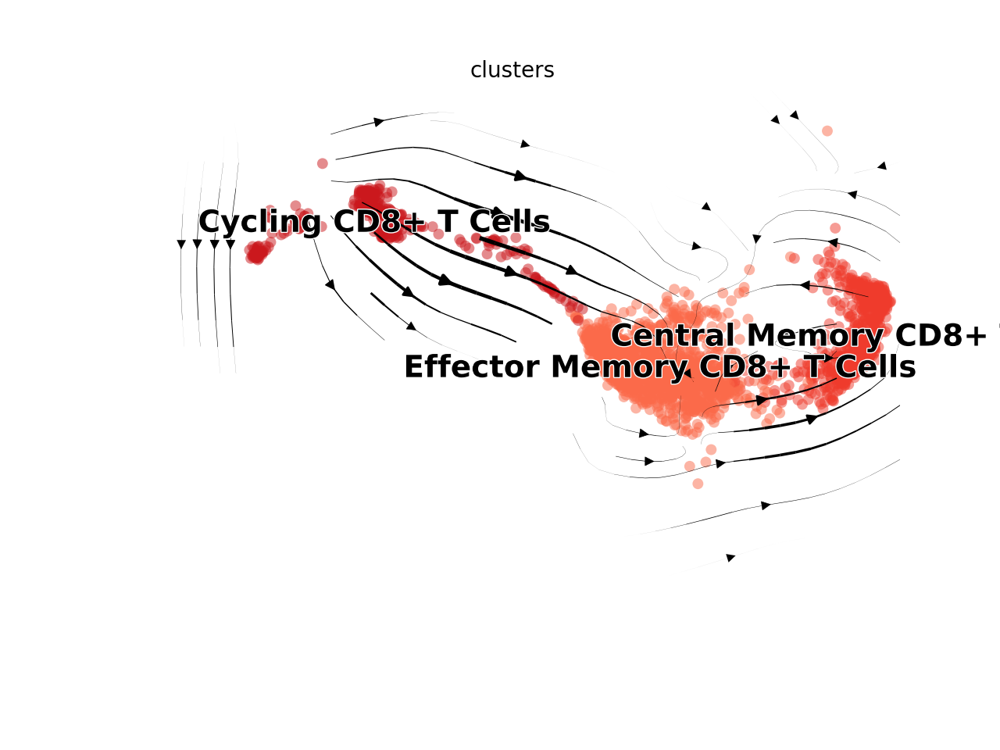
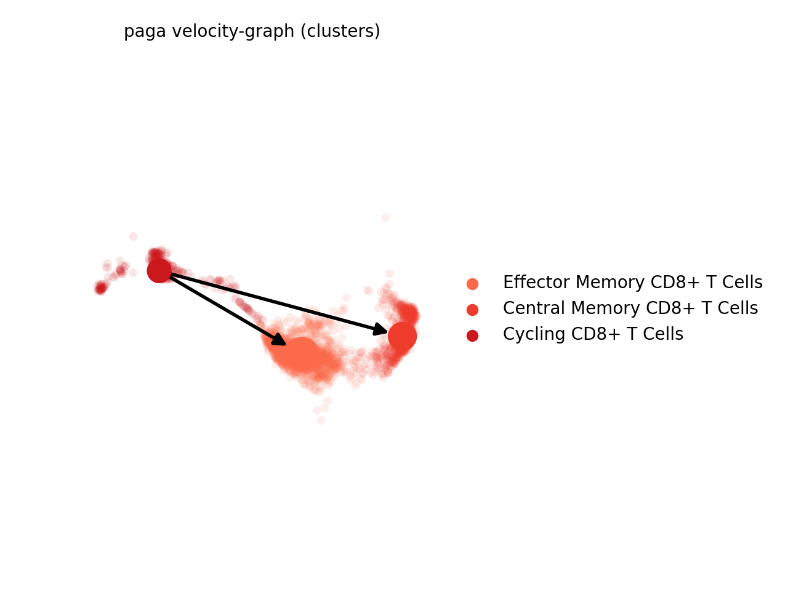

# Setup

```{r prep, echo=TRUE, warning=FALSE, message=FALSE}
library(Seurat)
library(RColorBrewer)
library(ggplot2)
library(dplyr)
library(ggpubr)
library(SingleCellExperiment)
library(ggrepel)
library(reticulate)
library(viridis)
library(ProjecTILs)
library(scales)

#Data file
data.integrated <- readRDS("../Inputs/IntegratedData.rds")

#Color panels
maccols <- brewer.pal(n=8, name="Blues")[c(-1,-3,-5,-7)]
monocols <- c("#ff8ade","#e324ad")
dccols <- brewer.pal(n=9, name="Greens")[-1]
tcols <- brewer.pal(n=8, name="Reds")[-1]
nkcols <- c("#876149","#6e3f22")
bcols <- brewer.pal(n=4, name="Purples")[-1]
othcols <- c("#71a157","#00c5cc","#a18e25","#b282b3")
strcols <- brewer.pal(n=4, name="Oranges")[-1]
wccols = c("#878787", "#518db6","#94cc73","#e96b53")

cols <- c(maccols,monocols,dccols,tcols,nkcols,bcols,othcols,strcols)

llcols <- c("#4292C6","#ff8ade","#238B45","#EF3B2C","#876149","#9E9AC8","#71a157","#00c5cc","#a18e25","#b282b3","#FD8D3C")

#Calculate cellspm
cellspm <- table(data.integrated$individual_mice, data.integrated$highlevel2)
propcellspm <- prop.table(cellspm, margin=1)
#Convert to a dataframe
cellspm <- as.data.frame(cellspm)
propcellspm <- as.data.frame(propcellspm)
#Change column names
colnames(cellspm) <- c("Mouse","Cluster","Counts")
colnames(propcellspm) <- c("Mouse","Cluster","Frequency")
#Add a column indicating the groups to each table
cellspm$Group <- gsub("_Hashtag.","", cellspm$Mouse)
propcellspm$Group <- gsub("_Hashtag.","", propcellspm$Mouse)
#Normalize "Counts" to "Counts per hundred cells sequenced"
cphc<-list()
cellspm <- cellspm %>% arrange(.,Mouse)
for (i in levels(cellspm$Mouse)){
  x <- sum(subset(cellspm, Mouse==i)$Counts)/100
  y <- subset(cellspm, Mouse==i)$Counts/x
  cphc <- append(cphc, y)
}
cellspm$CountsPerHundred <- as.numeric(cphc)
#Function to calculate standard error for each given variable (cell cluster)
 data_summary <- function(data, varname, groupnames){
  require(plyr)
  summary_func <- function(x, col){
    c(mean = mean(x[[col]], na.rm=TRUE),
      se = sd(x[[col]], na.rm=TRUE) / sqrt(sum(!is.na(x[[col]]))))
  }
  data_sum<-ddply(data, groupnames, .fun=summary_func,
                  varname)
names(data_sum)[names(data_sum) == 'mean'] <- varname
return(data_sum)
}
#Summarize the data
clustercounts <- data_summary(cellspm, varname="CountsPerHundred", groupnames=c("Group","Cluster"))
clusterprops <- data_summary(propcellspm, varname="Frequency", groupnames=c("Group","Cluster"))
```

# Figure 4

## Figure 4A

```{r Fig4A, echo=TRUE, fig.width=12, fig.height=4}
DefaultAssay(data.integrated) <- "RNA"
fig4cols <- c(rep("#e6e6e6",14),"#FEE0D2","#FCBBA1","#FC9272","#FB6A4A","#EF3B2C","#CB181D",rep("#e6e6e6",15))
DimPlot(data.integrated, split.by="orig.ident",group.by="highlevel2") + 
  NoLegend() + 
  labs(title="") &
  scale_color_manual(values=fig4cols) &
 NoAxes()

### just for legend
DimPlot(subset(data.integrated, lowlevel2=="T Cells"), split.by="orig.ident",group.by="highlevel2") + 
  labs(title="") &
  scale_color_manual(values=c("#FEE0D2","#FCBBA1","#FC9272","#FB6A4A","#EF3B2C","#CB181D","#e6e6e6"), labels=c("Th1 CD4+ T Cells","Th2 CD4+ T Cells","Tregs","EM CD8+ T Cells","CM CD8+ T Cells","Cycling CD8+ T Cells","gd T cells")) &
 NoAxes()
```

## Figure 4B

```{r fig4Bsetup}
fig4Tcells <- subset(data.integrated, highlevel2=="Th1 CD4+ T Cells" | highlevel2=="Th2 CD4+ T Cells" | highlevel2=="Tregs" | 
                   highlevel2=="Effector Memory CD8+ T Cells" | highlevel2=="Central Memory CD8+ T Cells"| highlevel2=="Cycling CD8+ T Cells")
```

```{r fig4B, fig.width=6, fig.height=6}
Idents(fig4Tcells) <- fig4Tcells$highlevel2
DefaultAssay(fig4Tcells) <- "RNA"
VlnPlot(fig4Tcells, 
        features=c("Cd3e","Cd4","Foxp3","Cd8b1","Cxcr3","Ccr7","Sell","Stmn1","Pclaf"), 
        stack=T, 
        flip=T,
        fill.by="ident",
        cols=c("#FEE0D2","#FCBBA1","#FC9272","#FB6A4A","#EF3B2C","#CB181D")) +
  labs(x="") + 
  scale_x_discrete(labels=c("Th1","Th2","Tregs",expression("T"['EM']), expression("T"['CM']),"Cycling")) + 
  NoLegend() +
  theme(aspect.ratio = 0.25, strip.text=element_text(face="bold.italic")) 
```

## Figure 4C

```{r fig4csetup, echo=TRUE}
Idents(data.integrated) <- data.integrated$orig.ident
tcellspm <- subset(cellspm, 
                      Cluster=="Th1 CD4+ T Cells" | 
                      Cluster=="Th2 CD4+ T Cells" |
                      Cluster=="Tregs" |
                      Cluster=="Effector Memory CD8+ T Cells"|
                      Cluster=="Central Memory CD8+ T Cells"|
                      Cluster=="Cycling CD8+ T Cells")
tcellspm$Group <- factor(tcellspm$Group, levels = c("Lean","Obese","WL","WC"))
tclustercounts <- subset(clustercounts, 
                      Cluster=="Th1 CD4+ T Cells" | 
                      Cluster=="Th2 CD4+ T Cells" |
                      Cluster=="Tregs" |
                      Cluster=="Effector Memory CD8+ T Cells"|
                      Cluster=="Central Memory CD8+ T Cells"|
                      Cluster=="Cycling CD8+ T Cells")
tclustercounts$Group <- factor(tclustercounts$Group, levels = c("Lean","Obese","WL","WC"))
```

```{r fig4cstats, echo=TRUE, fig.width=3, fig.height=3}
compare_means(CountsPerHundred ~ Group, data = subset(tcellspm, Cluster=="Th1 CD4+ T Cells"), method="t.test", p.adjust.method = "bonferroni")
        
compare_means(CountsPerHundred ~ Group, data = subset(tcellspm, Cluster=="Th2 CD4+ T Cells"), method="t.test", p.adjust.method = "bonferroni")

compare_means(CountsPerHundred ~ Group, data = subset(tcellspm, Cluster=="Tregs"), method="t.test", p.adjust.method = "bonferroni")

compare_means(CountsPerHundred ~ Group, data = subset(tcellspm, Cluster=="Effector Memory CD8+ T Cells"), method="t.test", p.adjust.method = "bonferroni")

compare_means(CountsPerHundred ~ Group, data = subset(tcellspm, Cluster=="Central Memory CD8+ T Cells"), method="t.test", p.adjust.method = "bonferroni")

compare_means(CountsPerHundred ~ Group, data = subset(tcellspm, Cluster=="Cycling CD8+ T Cells"), method="t.test", p.adjust.method = "bonferroni")
```

```{r fig4c, echo=TRUE, fig.width=3, fig.height=3}
ggboxplot(d=subset(tcellspm, Cluster=="Th1 CD4+ T Cells"), 
          x="Group", 
          y="CountsPerHundred",  
          fill="Group", 
          facet.by="Cluster", 
          add = "mean_se")  +
    theme_classic() +
    scale_fill_manual(values=wccols) +
    theme(axis.text.x=element_text(face="bold", size=10)) + 
    labs(x="", y="") +
    theme(axis.text.x = element_blank(), axis.ticks = element_blank()) +
    facet_wrap(~Cluster) + 
    NoLegend() + 
    ylim(0,10)
ggboxplot(d=subset(tcellspm, Cluster=="Th2 CD4+ T Cells"), 
          x="Group", 
          y="CountsPerHundred",  
          fill="Group", 
          facet.by="Cluster", 
          add = "mean_se") +
    theme_classic() +
    scale_fill_manual(values=wccols) +
    theme(axis.text.x=element_text(face="bold", size=10)) + 
    labs(x="", y="") +
    theme(axis.text.x = element_blank(), axis.ticks = element_blank()) +
    facet_wrap(~Cluster) + 
    NoLegend() + 
    ylim(0,1)
ggboxplot(d=subset(tcellspm, Cluster=="Tregs"), 
          x="Group", 
          y="CountsPerHundred",  
          fill="Group", 
          facet.by="Cluster", 
          add = "mean_se") +
    theme_classic() +
    scale_fill_manual(values=wccols) +
    theme(axis.text.x=element_text(face="bold", size=10)) + 
    labs(x="", y="") +
    theme(axis.text.x = element_blank(), axis.ticks = element_blank()) +
    facet_wrap(~Cluster) + 
    NoLegend() + 
    ylim(0,8)
ggboxplot(d=subset(tcellspm, Cluster=="Effector Memory CD8+ T Cells"), 
          x="Group", 
          y="CountsPerHundred",  
          fill="Group", 
          facet.by="Cluster", 
          add = "mean_se") +
    theme_classic() +
    scale_fill_manual(values=wccols) +
    theme(axis.text.x=element_text(face="bold", size=10)) + 
    labs(x="", y="") +
    theme(axis.text.x = element_blank(), axis.ticks = element_blank()) +
    facet_wrap(~Cluster) + 
    NoLegend() + 
    ylim(0,10)
ggboxplot(d=subset(tcellspm, Cluster=="Central Memory CD8+ T Cells"), 
          x="Group", 
          y="CountsPerHundred",  
          fill="Group", 
          facet.by="Cluster", 
          add = "mean_se") +
    theme_classic() +
    scale_fill_manual(values=wccols) +
    theme(axis.text.x=element_text(face="bold", size=10)) + 
    labs(x="", y="") +
    theme(axis.text.x = element_blank(), axis.ticks = element_blank()) +
    facet_wrap(~Cluster) + 
    NoLegend() + 
    ylim(0,12)
ggboxplot(d=subset(tcellspm, Cluster=="Cycling CD8+ T Cells"), 
          x="Group", 
          y="CountsPerHundred",  
          fill="Group", 
          facet.by="Cluster", 
          add = "mean_se") +
    theme_classic() +
    scale_fill_manual(values=wccols) +
    theme(axis.text.x=element_text(face="bold", size=10)) + 
    labs(x="", y="") +
    theme(axis.text.x = element_blank(), axis.ticks = element_blank()) +
    facet_wrap(~Cluster) + 
    NoLegend() + 
    ylim(0,3)
```

## Figure 4D

```{r Fig4D, fig.width=8, fig.height=2}
FeaturePlot(subset(data.integrated,highlevel2=="Tregs"), features=c("Foxp3","Il1rl1"), split.by="orig.ident", by.col=T, pt.size=1) & theme_void() & NoLegend() & scale_color_viridis(option="B", limits=c(0,3)) & ylim(0,3) & xlim(10,14)

### for scale bar
FeaturePlot(subset(data.integrated,highlevel2=="Tregs"), features=c("Foxp3","Il1rl1"), split.by="orig.ident", by.col=T, pt.size=0.5)  & scale_color_viridis(option="B", limits=c(0,3)) & ylim(0,3) & xlim(10,14) & theme(legend.position="bottom")
```

## Figure 4E

For plotting rna velocity, I have a conda env containing scvelo (v0.2.3) and scanpy (v1.7.2).
Knitting this whole file takes >~8gb of RAM. I've set `eval=FALSE` in the chunk options so that I can knit this on my local machine quickly. For running this fresh, just change to `eval=TRUE`.
```{r fig4Esetup, echo=TRUE, eval=FALSE}
#Prep environment for reticulate (i.e. we are running Python through R)
use_condaenv("r-velocity", required = TRUE)
conda_list()
scv <- import("scvelo")
scanpy <- import("scanpy")
matplotlib <- import("matplotlib")
plt <- import("matplotlib.pyplot", as = "plt")

#Subset for cDC clusters
Idents(data.integrated) <- data.integrated$highlevel2
Tcellvelo <- subset(data.integrated, 
                   highlevel2=="Effector Memory CD8+ T Cells" | highlevel2=="Central Memory CD8+ T Cells"| highlevel2=="Cycling CD8+ T Cells")
Idents(Tcellvelo) <- Tcellvelo$highlevel2

#Create an adata object. Making this from pieces was the only way I could get it to work (Seurat -> adata conversion  is difficult).
spliced = Tcellvelo@assays$spliced@counts
unspliced = Tcellvelo@assays$unspliced@counts
row.num <- which(rownames(spliced) %in% rownames(Tcellvelo@assays$RNA@counts))
spliced <- spliced[c(row.num),]
unspliced <- unspliced[c(row.num),]
ad <- import("anndata", convert=FALSE)
orig.ident <- Tcellvelo$orig.ident
HTO_maxID <- Tcellvelo$HTO_maxID
lowlevel2 <- Tcellvelo$lowlevel2
highlevel2 <- Tcellvelo$highlevel2
clusters <- Tcellvelo$highlevel2
dfobs <- data.frame(orig.ident, HTO_maxID, lowlevel2, highlevel2, clusters)
rownames(dfobs) <- names(Tcellvelo$orig.barcodes)
genes_attributes <- rownames(Tcellvelo@assays$RNA@counts)
dfvar <- data.frame(genes_attributes)
rownames(dfvar) <- rownames(Tcellvelo@assays$RNA@counts)
emb <- Embeddings(Tcellvelo, "umap")
adata_Tcell <- ad$AnnData(
  X=t(Tcellvelo@assays$RNA@counts),
  obs=dfobs,
  var=dfvar,
  layers=list('spliced'=t(spliced), 'unspliced'=t(unspliced)),
  obsm=list('X_umap'=emb)) 
adata_Tcell

#Run through the scvelo pipeline and generate a dynamic velocity estimate.
scv$pp$filter_genes(adata_Tcell)
scv$pp$moments(adata_Tcell)
scv$tl$recover_dynamics(adata_Tcell)
scv$tl$velocity(adata_Tcell, mode='dynamical')
scv$tl$velocity_graph(adata_Tcell)

#Run PAGA using the dynamic velocity estimates
scv$tl$paga(adata_Tcell, groups='clusters')

#Colors  for plot
Tcell.colors <- c("#FB6A4A","#EF3B2C","#CB181D")
```

```{r fig4E, fig.width=5, fig.height=5, eval=FALSE}
#save as "scvelo1.png" - This is already available in the "figures" folder.
scv$pl$velocity_embedding_stream(adata_Tcell, 
                                 basis='umap', 
                                 size=100,
                                 legend_fontsize=14,
                                 palette=Tcell.colors,
                                 smooth=TRUE,
                                 min_mass=0,
                                 alpha=0.5)

#save as "scvelo2.png" - This is already available in the "figures" folder.
scv$pl$paga(adata_Tcell, basis='umap', size=100, alpha=0.1,
             min_edge_width=2, node_size_scale=1.5)
```

```{r Fig4eouts, fig.width=5, fig.height=5}



```

## Figure 4F

```{r fig4F, fig.width=8, fig.height=2, warning=FALSE}
Texhaustion_gex <- list(c("Pdcd1","Tigit","Tox","Entpd1","Lag3"))
DefaultAssay(fig4Tcells) <- "RNA"

fig4Tcells <- AddModuleScore(fig4Tcells,
                             features=Texhaustion_gex,
                             assay="RNA",
                             name='Texhaustion_gex')

FeaturePlot(fig4Tcells, 
            features="Texhaustion_gex1", split.by="orig.ident", order=T) & 
  xlim(1,13) &
  ylim(-5,4) & 
  theme_void() & 
  labs(title="") & 
  NoLegend() &
  scale_color_viridis(option="A", limits=c(0,2), breaks=c(0,1,2), oob=squish)

#For scale bars
FeaturePlot(fig4Tcells, 
            features="Texhaustion_gex1", split.by="orig.ident", order=T) & 
  xlim(1,13) &
  ylim(-5,4) & 
  theme_void() & 
  labs(title="") & 
  theme(legend.position="bottom") &
  scale_color_viridis(option="A", limits=c(0,2),breaks=c(0,1,2), oob=squish)
```

## Figure 4G

```{r fig4G, fig.width=8, fig.height=2, warning=FALSE}
Texhaustion_ADT <- list(c("TIGIT","CD279"))

DefaultAssay(fig4Tcells) <- "RNA"

fig4Tcells<- AddModuleScore(fig4Tcells,
                             features=Texhaustion_ADT,
                             name='Texhaustion_ADT')

FeaturePlot(fig4Tcells, 
            features="Texhaustion_ADT1", split.by="orig.ident", order=T) & 
  xlim(1,13) &
  ylim(-5,4) & 
  theme_void() & 
  labs(title="") &
  NoLegend() &
  scale_color_viridis(option="A", limits=c(0,2), breaks=c(0,1,2), oob=squish)

#For scale bars

FeaturePlot(fig4Tcells, 
            features="Texhaustion_ADT1", split.by="orig.ident", order=T) & 
  xlim(1,13) &
  ylim(-5,4) & 
  theme_void() & 
  labs(title="") & 
  theme(legend.position="bottom") &
  scale_color_viridis(option="A", limits=c(0,2), breaks=c(0,1,2), oob=squish)
```

## Figure 4H

```{r figHsetup2, fig.width=3, fig.height=3}
#Download ProjectTILs reference from Figshare: https://figshare.com/articles/dataset/ProjecTILs_murine_reference_atlas_of_virus-specific_CD8_T_cells_version_1/12489518
#download.file('https://figshare.com/ndownloader/files/23136746', destfile="../Inputs/Fig4/ref_LCMV_Atlas_mouse_v1.rds")

#Split Tcells into CD8 or CD4
fig4Tcells <- RenameIdents(fig4Tcells, 
                          'Th1 CD4+ T Cells' = 'CD4+ T Cells', 
                          'Th2 CD4+ T Cells' = 'CD4+ T Cells', 
                          'Tregs' = 'CD4+ T Cells',
                          'Effector Memory CD8+ T Cells' = 'CD8+ T Cells',
                          'Central Memory CD8+ T Cells' = 'CD8+ T Cells',
                          'Cycling CD8+ T Cells' = 'CD8+ T Cells')
fig4Tcells$Tlevels <- Idents(fig4Tcells)
Idents(fig4Tcells) <- fig4Tcells$highlevel2

#Load ProjecTILs Seurat reference using LCMV atlas
ref2 <- load.reference.map("../Inputs/Fig4/ref_LCMV_Atlas_mouse_v1.rds")
ref2Cols <- c("#edbe2a", "#A58AFF", "#53B400", "#F8766D", "#00B6EB", "#d1cfcc", "#FF0000", "#87f6a5", "#e812dd")
DimPlot(ref2,label = T, cols =ref2Cols, pt.size=1) + theme_void() + NoLegend()

#Project diet groups onto ProjecTILs annotated cells
LeanPTils2 <- make.projection(subset(fig4Tcells, orig.ident=="Lean" & Tlevels=="CD8+ T Cells"), ref=ref2, skip.normalize=T, seurat.k.filter=100, filter.cells=F)
ObesePTils2 <- make.projection(subset(fig4Tcells, orig.ident=="Obese" & Tlevels=="CD8+ T Cells"), ref=ref2, skip.normalize=T, seurat.k.filter=100, filter.cells=F)
WLPTils2 <- make.projection(subset(fig4Tcells, orig.ident=="WL" & Tlevels=="CD8+ T Cells"), ref=ref2, skip.normalize=T, seurat.k.filter=100, filter.cells=F)
WCPTils2 <- make.projection(subset(fig4Tcells, orig.ident=="WC" & Tlevels=="CD8+ T Cells"), ref=ref2, skip.normalize=T, seurat.k.filter=100, filter.cells=F)

#Predict cellstate for mapping
LeanPTils2 <- cellstate.predict(ref=ref2, query=LeanPTils2)
ObesePTils2 <- cellstate.predict(ref=ref2, query=ObesePTils2)
WLPTils2 <- cellstate.predict(ref=ref2, query=WLPTils2)
WCPTils2 <- cellstate.predict(ref=ref2, query=WCPTils2)
```

```{r fig4H2, fig.height=2, fig.width=2}
#Reference and labels
DimPlot(ref2, reduction="umap", label=F, cols=c("#edbe2a", "#A58AFF", "#53B400", "#F8766D", 
                "#00B6EB", "#d1cfcc", "#FF0000", "#87f6a5", "#e812dd"), pt.size=0.5)+
    theme_void() +
  NoLegend() 
DimPlot(ref2, reduction="umap", label=F, cols=c("#edbe2a", "#A58AFF", "#53B400", "#F8766D", 
                "#00B6EB", "#d1cfcc", "#FF0000", "#87f6a5", "#e812dd"))+
    theme_void(base_size = 14) 

#Diet groups
DimPlot(ref2, reduction="umap", label=F, cols=c(rep("#e8e8e8",9)), pt.size=0.5) +
  geom_point(data.frame(LeanPTils2@reductions$umap@cell.embeddings), 
             mapping = aes(x = UMAP_1, y = UMAP_2),
             alpha = 1,
             size = 1.5,
             shape = 16,
             color = wccols[1]) + 
  theme_void() +
  NoLegend() 

DimPlot(ref2, reduction="umap", label=F, cols=c(rep("#e8e8e8",9)), pt.size=0.5) +
  geom_point(data.frame(ObesePTils2@reductions$umap@cell.embeddings), 
             mapping = aes(x = UMAP_1, y = UMAP_2),
             alpha = 1,
             size = 1.5,
             shape = 16,
             color = wccols[2]) + 
  theme_void() +
  NoLegend() 

DimPlot(ref2, reduction="umap", label=F, cols=c(rep("#e8e8e8",9)), pt.size=0.5) +
  geom_point(data.frame(WLPTils2@reductions$umap@cell.embeddings), 
             mapping = aes(x = UMAP_1, y = UMAP_2),
             alpha = 1,
             size = 1.5,
             shape = 16,
             color = wccols[3]) + 
  theme_void() +
  NoLegend() 

DimPlot(ref2, reduction="umap", label=F, cols=c(rep("#e8e8e8",9)), pt.size=0.5) +
  geom_point(data.frame(WCPTils2@reductions$umap@cell.embeddings), 
             mapping = aes(x = UMAP_1, y = UMAP_2),
             alpha = 1,
             size = 1.5,
             shape = 16,
             color = wccols[4]) + 
  theme_void() +
  NoLegend() 
```


# Session Info
```{r si}
sessionInfo()
```

