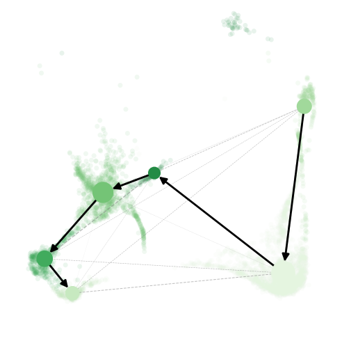

# Setup

```{r prep, warning=FALSE, message=FALSE}
library(Seurat)
library(RColorBrewer)
library(ggplot2)
library(dplyr)
library(ggpubr)
library(SingleCellExperiment)
library(DESeq2)
library(Matrix.utils)
library(magrittr)
library(stringr)
library(pheatmap)
library(tibble)
library(purrr)
library(tidyr)
library(DEGreport)
library(ggrepel)
library(reticulate)
library(viridis)

#Data file
data.integrated <- readRDS("../Inputs/IntegratedData.rds")

#Color panels
maccols <- brewer.pal(n=8, name="Blues")[c(-1,-3,-5,-7)]
monocols <- c("#ff8ade","#e324ad")
dccols <- brewer.pal(n=9, name="Greens")[-1]
tcols <- brewer.pal(n=8, name="Reds")[-1]
nkcols <- c("#876149","#6e3f22")
bcols <- brewer.pal(n=4, name="Purples")[-1]
othcols <- c("#71a157","#00c5cc","#a18e25","#b282b3")
strcols <- brewer.pal(n=4, name="Oranges")[-1]
wccols = c("Lean" = "#878787", "Obese"="#518db6","WL"="#94cc73","WC"="#e96b53")

cols <- c(maccols,monocols,dccols,tcols,nkcols,bcols,othcols,strcols)

llcols <- c("#4292C6","#ff8ade","#238B45","#EF3B2C","#876149","#9E9AC8","#71a157","#00c5cc","#a18e25","#b282b3","#FD8D3C")

#Calculate cellspm
cellspm <- table(data.integrated$individual_mice, data.integrated$highlevel2)
propcellspm <- prop.table(cellspm, margin=1)
#Convert to a dataframe
cellspm <- as.data.frame(cellspm)
propcellspm <- as.data.frame(propcellspm)
#Change column names
colnames(cellspm) <- c("Mouse","Cluster","Counts")
colnames(propcellspm) <- c("Mouse","Cluster","Frequency")
#Add a column indicating the groups to each table
cellspm$Group <- gsub("_Hashtag.","", cellspm$Mouse)
propcellspm$Group <- gsub("_Hashtag.","", propcellspm$Mouse)
#Normalize "Counts" to "Counts per hundred cells sequenced"
cphc<-list()
cellspm <- cellspm %>% arrange(.,Mouse)
for (i in levels(cellspm$Mouse)){
  x <- sum(subset(cellspm, Mouse==i)$Counts)/100
  y <- subset(cellspm, Mouse==i)$Counts/x
  cphc <- append(cphc, y)
}
cellspm$CountsPerHundred <- as.numeric(cphc)
#Function to calculate standard error for each given variable (cell cluster)
 data_summary <- function(data, varname, groupnames){
  require(plyr)
  summary_func <- function(x, col){
    c(mean = mean(x[[col]], na.rm=TRUE),
      se = sd(x[[col]], na.rm=TRUE) / sqrt(sum(!is.na(x[[col]]))))
  }
  data_sum<-ddply(data, groupnames, .fun=summary_func,
                  varname)
names(data_sum)[names(data_sum) == 'mean'] <- varname
return(data_sum)
}
#Summarize the data
clustercounts <- data_summary(cellspm, varname="CountsPerHundred", groupnames=c("Group","Cluster"))
clusterprops <- data_summary(propcellspm, varname="Frequency", groupnames=c("Group","Cluster"))
```

# Figure 5

## Figure 5A

```{r Fig5A, echo=TRUE, fig.width=12, fig.height=4}
fig5cols <- c(rep("#e6e6e6",4),"#ff8ade","#e324ad","#E5F5E0","#C7E9C0","#A1D99B","#74C476","#41AB5D","#238B45","#006D2C","#00441B",rep("#e6e6e6",19))
DimPlot(data.integrated, split.by="orig.ident",group.by="highlevel2") + 
  NoLegend() + 
  labs(title="") &
  scale_color_manual(values=fig5cols) &
 NoAxes()
```

## Figure 5B

```{r Fig5Bsetup}
Monocytes <- subset(data.integrated, highlevel2=="Classical Monocytes" | highlevel2=="Non-classical Monocytes")
Monocytes$highlevel2 <- factor(Monocytes$highlevel2, levels=c("Classical Monocytes","Non-classical Monocytes"))
```

```{r Fig5B, fig.width=6, fig.height=5.5}
Idents(Monocytes) <- Monocytes$highlevel2
DefaultAssay(Monocytes) <- "RNA"
VlnPlot(Monocytes, 
        features=c("Lyz2","Lst1","Plac8","Fcgr1","Ly6c2","Ccr2","Cd14","Ear2","Cx3cr1","Ace"), 
        stack=T, 
        flip=T,
        fill.by="ident",
        cols=c("#ff8ade","#e324ad","#00441B","#E5F5E0","#74C476")) +
  labs(x="") + 
  NoLegend() +
  theme(aspect.ratio = 0.25, strip.text=element_text(face="bold.italic")) + 
  scale_x_discrete(labels=c("Classical","Non-classical"))
```

## Figure 5C

```{r Fig5Csetup, echo=TRUE}
monocellspm <- subset(cellspm, 
                          Cluster=="Classical Monocytes" | 
                          Cluster=="Non-classical Monocytes" )
monocellspm$Group <- factor(monocellspm$Group, levels = c("Lean","Obese","WL","WC"))
monoclustercounts <- subset(clustercounts, 
                            Cluster=="Classical Monocytes" | 
                            Cluster=="Non-classical Monocytes")
monoclustercounts$Group <- factor(monoclustercounts$Group, levels = c("Lean","Obese","WL","WC"))
```

```{r Fig5Cstats, echo=TRUE, fig.width=3, fig.height=3}
#T tests with bonferroni correction are used here comparing all groups to the reference lean control group.
compare_means(CountsPerHundred ~ Group, data = subset(monocellspm, Cluster=="Classical Monocytes"), method="t.test", p.adjust.method = "bonferroni", ref.group="Lean")

compare_means(CountsPerHundred ~ Group, data = subset(monocellspm, Cluster=="Non-classical Monocytes"), method="t.test", p.adjust.method = "bonferroni", ref.group="Lean")
```

```{r Fig5C, echo=TRUE, fig.width=3, fig.height=3}
ggboxplot(d=subset(monocellspm, Cluster=="Classical Monocytes"), 
          x="Group", 
          y="CountsPerHundred",  
          fill="Group", 
          facet.by="Cluster", 
          add = "mean_se")  +
    theme_classic() +
    scale_fill_manual(values=wccols) +
    theme(axis.text.y=element_text(face="bold", size=10)) + 
    labs(x="", y="") +
    theme(axis.text.x = element_blank(), axis.ticks = element_blank(), strip.text = element_text(face="bold", size=10)) +
    facet_wrap(~Cluster) + 
    NoLegend() + 
    ylim(0,20)
ggboxplot(d=subset(monocellspm, Cluster=="Non-classical Monocytes"), 
          x="Group", 
          y="CountsPerHundred",  
          fill="Group", 
          facet.by="Cluster", 
          add = "mean_se") +
    theme_classic() +
    scale_fill_manual(values=wccols) +
    theme(axis.text.y=element_text(face="bold", size=10)) + 
    labs(x="", y="") +
    theme(axis.text.x = element_blank(), axis.ticks = element_blank(), strip.text = element_text(face="bold", size=10)) +
    facet_wrap(~Cluster) + 
    NoLegend() + 
    ylim(0,5)
#Just for the legend
ggboxplot(d=subset(monocellspm, Cluster=="Non-classical Monocytes"), 
          x="Group", 
          y="CountsPerHundred",  
          fill="Group", 
          facet.by="Cluster", 
          add = "mean_se") +
    theme_classic() +
    scale_fill_manual(values=wccols) +
    theme(axis.text.x=element_text(face="bold", size=10)) + 
    labs(x="", y="") +
    theme(axis.text.x = element_blank(), axis.ticks = element_blank()) +
    facet_wrap(~Cluster) +
    ylim(0,5)
```

## Figure 5D

```{r Fig5d, fig.width=8, fig.height=6}
Idents(Monocytes) <- Monocytes$orig.ident
DefaultAssay(Monocytes) <- "RNA"
VlnPlot(subset(Monocytes,highlevel2=="Classical Monocytes"), 
        features=c("Cd36","Trem2","Cd9","Cd81","Cd63","Cd80","Cd86","Cd40"), 
        stack=T, 
        flip=T,
        fill.by="ident",
        cols=wccols) +
  labs(x="") + 
  NoLegend() +
 theme(aspect.ratio = 0.25, strip.text=element_text(face="bold.italic"), text=element_text(size=18), axis.text.x = element_text(size=16)) + 
  scale_x_discrete(labels=c("Lean","Obese","WL","WC")) 
```

## Figure 5E

```{r Fig5esetup}
Fig5DCs <- subset(data.integrated, highlevel2=="cDC1" | highlevel2=="Activated cDC1" | highlevel2=="Cycling cDC1" |  highlevel2=="cDC2" | highlevel2=="Activated cDC2" | highlevel2=="Cycling cDC2" | highlevel2=="pDCs" | highlevel2=="moDCs")
```

```{r Fig5e, fig.width=6, fig.height=6}
Idents(Fig5DCs) <- Fig5DCs$highlevel2
DefaultAssay(Fig5DCs) <- "RNA"
VlnPlot(Fig5DCs, 
        features=c("Cst3","Clec9a","Xcr1","Sirpa","Cd209a","Stmn1","Pclaf","Siglech","Ear2"), 
        stack=T, 
        flip=T,
        fill.by="ident",
        cols=c("#E5F5E0","#C7E9C0","#A1D99B","#74C476","#41AB5D","#238B45","#006D2C","#00441B")) +
  labs(x="") + 
  NoLegend() +
  theme(aspect.ratio = 0.25, strip.text=element_text(face="bold.italic")) 
```


## Figure 5F

```{r Fig5fsetup, echo=TRUE}
dccomps <- list(c("Lean","WL"),c("Lean","Obese"),c("Obese","WC"))
DCscellspm <- subset(cellspm, 
                          Cluster=="cDC1" | 
                          Cluster=="Activated cDC1" | 
                          Cluster=="Cycling cDC1" |
                          Cluster=="cDC2" |
                          Cluster=="Activated cDC2" | 
                          Cluster=="Cycling cDC2" |
                          Cluster=="moDCs" | 
                          Cluster=="pDCs")
DCscellspm$Group <- factor(DCscellspm$Group, levels = c("Lean","Obese","WL","WC"))
DCsclustercounts <- subset(clustercounts, 
              Cluster=="cDC1" | 
              Cluster=="Activated cDC1" |
              Cluster=="Cycling cDC1" |
              Cluster=="cDC2" |
              Cluster=="Activated cDC2" |
              Cluster=="Cycling cDC2" |
              Cluster=="moDCs" | 
              Cluster=="pDCs")
DCsclustercounts$Group <- factor(DCsclustercounts$Group, levels = c("Lean","Obese","WL","WC"))
```

```{r Fig5fstats, echo=TRUE, warning=FALSE, message=FALSE, fig.width=3, fig.height=3}
#T-test with bonferroni correction for multiple comparisons was used to compare all groups to the Lean reference control.
compare_means(CountsPerHundred ~ Group, data = subset(DCscellspm, Cluster=="cDC1"), method="t.test", p.adjust.method = "bonferroni", ref.group="Lean")

compare_means(CountsPerHundred ~ Group, data = subset(DCscellspm, Cluster=="Activated cDC1"), method="t.test", p.adjust.method = "bonferroni", ref.group="Lean")

compare_means(CountsPerHundred ~ Group, data = subset(DCscellspm, Cluster=="Cycling cDC1"), method="t.test", p.adjust.method = "bonferroni", ref.group="Lean")

compare_means(CountsPerHundred ~ Group, data = subset(DCscellspm, Cluster=="cDC2"), method="t.test", p.adjust.method = "bonferroni", ref.group="Lean")

compare_means(CountsPerHundred ~ Group, data = subset(DCscellspm, Cluster=="Activated cDC2"), method="t.test", p.adjust.method = "bonferroni", ref.group="Lean")

compare_means(CountsPerHundred ~ Group, data = subset(DCscellspm, Cluster=="Cycling cDC2"), method="t.test", p.adjust.method = "bonferroni", ref.group="Lean")

compare_means(CountsPerHundred ~ Group, data = subset(DCscellspm, Cluster=="moDCs"), method="t.test", p.adjust.method = "bonferroni", ref.group="Lean")

compare_means(CountsPerHundred ~ Group, data = subset(DCscellspm, Cluster=="pDCs"), method="t.test", p.adjust.method = "bonferroni", ref.group="Lean")
```

```{r Fig5f, echo=TRUE, warning=FALSE, message=FALSE, fig.width=3, fig.height=3}
ggboxplot(d=subset(DCscellspm, Cluster=="cDC1"), 
          x="Group", 
          y="CountsPerHundred",  
          fill="Group", 
          facet.by="Cluster", 
          add = "mean_se") + 
    theme_classic() +
    scale_fill_manual(values=wccols) +
    theme(axis.text.y=element_text(face="bold", size=10), strip.text = element_text(face="bold",size=10)) + 
    labs(x="", y="") +
    theme(axis.text.x = element_blank(), axis.ticks = element_blank()) +
    facet_wrap(~Cluster) + 
    NoLegend() + 
    ylim(0,10)

ggboxplot(d=subset(DCscellspm, Cluster=="Activated cDC1"), 
          x="Group", 
          y="CountsPerHundred",  
          fill="Group", 
          facet.by="Cluster", 
          add = "mean_se") +
    theme_classic() +
    scale_fill_manual(values=wccols) +
    theme(axis.text.y=element_text(face="bold", size=10), strip.text = element_text(face="bold",size=10)) +
    labs(x="", y="") +
    theme(axis.text.x = element_blank(), axis.ticks = element_blank()) +
    facet_wrap(~Cluster) + 
    NoLegend() + 
    ylim(0,2)
ggboxplot(d=subset(DCscellspm, Cluster=="Cycling cDC1"), 
          x="Group", 
          y="CountsPerHundred",  
          fill="Group", 
          facet.by="Cluster", 
          add = "mean_se")   +
    theme_classic() +
    scale_fill_manual(values=wccols) +
    theme(axis.text.y=element_text(face="bold", size=10), strip.text = element_text(face="bold",size=10)) + 
    labs(x="", y="") +
    theme(axis.text.x = element_blank(), axis.ticks = element_blank()) +
    facet_wrap(~Cluster) + 
    NoLegend() + 
    ylim(0,2)
ggboxplot(d=subset(DCscellspm, Cluster=="cDC2"), 
          x="Group", 
          y="CountsPerHundred",  
          fill="Group", 
          facet.by="Cluster", 
          add = "mean_se") +
    theme_classic() +
    scale_fill_manual(values=wccols) +
    theme(axis.text.y=element_text(face="bold", size=10), strip.text = element_text(face="bold",size=10)) +
    labs(x="", y="") +
    theme(axis.text.x = element_blank(), axis.ticks = element_blank()) +
    facet_wrap(~Cluster) + 
    NoLegend() + 
    ylim(0,6)
ggboxplot(d=subset(DCscellspm, Cluster=="Activated cDC2"), 
          x="Group", 
          y="CountsPerHundred",  
          fill="Group", 
          facet.by="Cluster", 
          add = "mean_se")   +
    theme_classic() +
    scale_fill_manual(values=wccols) +
    theme(axis.text.y=element_text(face="bold", size=10), strip.text = element_text(face="bold",size=10)) +
    labs(x="", y="") +
    theme(axis.text.x = element_blank(), axis.ticks = element_blank()) +
    facet_wrap(~Cluster) + 
    NoLegend() + 
    ylim(0,3)
ggboxplot(d=subset(DCscellspm, Cluster=="Cycling cDC2"), 
          x="Group", 
          y="CountsPerHundred",  
          fill="Group", 
          facet.by="Cluster", 
          add = "mean_se")   +
    theme_classic() +
    scale_fill_manual(values=wccols) +
    theme(axis.text.y=element_text(face="bold", size=10), strip.text = element_text(face="bold",size=10)) +
    labs(x="", y="") +
    theme(axis.text.x = element_blank(), axis.ticks = element_blank()) +
    facet_wrap(~Cluster) + 
    NoLegend() + 
    ylim(0,1)
ggboxplot(d=subset(DCscellspm, Cluster=="moDCs"), 
          x="Group", 
          y="CountsPerHundred",  
          fill="Group", 
          facet.by="Cluster", 
          add = "mean_se") + 
    theme_classic() +
    scale_fill_manual(values=wccols) +
    theme(axis.text.y=element_text(face="bold", size=10), strip.text = element_text(face="bold",size=10)) + 
    labs(x="", y="") +
    theme(axis.text.x = element_blank(), axis.ticks = element_blank()) +
    facet_wrap(~Cluster) + 
    NoLegend() + 
    ylim(0,8)
ggboxplot(d=subset(DCscellspm, Cluster=="pDCs"), 
          x="Group", 
          y="CountsPerHundred",  
          fill="Group", 
          facet.by="Cluster", 
          add = "mean_se") + 
    theme_classic() +
    scale_fill_manual(values=wccols) +
    theme(axis.text.y=element_text(face="bold", size=10), strip.text = element_text(face="bold",size=10)) + 
    labs(x="", y="") +
    theme(axis.text.x = element_blank(), axis.ticks = element_blank()) +
    facet_wrap(~Cluster) + 
    NoLegend() + 
    ylim(0,1)
```

## Figure 5G

```{r Fig5Gsetup}
Fig5DCs <- subset(data.integrated, highlevel2=="cDC1" | highlevel2=="Activated cDC1" | highlevel2=="Cycling cDC1" |  highlevel2=="cDC2" | highlevel2=="Activated cDC2" | highlevel2=="Cycling cDC2" | highlevel2=="pDCs" | highlevel2=="moDCs")
```

```{r Fig5G, fig.width=6, fig.height=6}
Idents(Fig5DCs) <- Fig5DCs$highlevel2
DefaultAssay(Fig5DCs) <- "RNA"
VlnPlot(Fig5DCs, 
        features=c("Ccr7","Mreg","Fscn1","Il15ra","Il12b","Fabp5","Ldha"), 
        stack=T, 
        flip=T,
        fill.by="ident",
        cols=c("#E5F5E0","#C7E9C0","#A1D99B","#74C476","#41AB5D","#238B45","#006D2C","#00441B")) +
  labs(x="") + 
  NoLegend() +
  theme(aspect.ratio = 0.3) 
```

## Figure 5H

For plotting rna velocity, I have a conda env containing scvelo (v0.2.3) and scanpy (v1.7.2).
Knitting this whole file takes >~8gb of RAM. I've set `eval=FALSE` in the chunk options so that I can knit this on my local machine quickly. For running this fresh, just change to `eval=TRUE`.
```{r Fig5hsetup, echo=TRUE, eval=FALSE}
#Prep environment for reticulate (i.e. we are running Python through R)
use_condaenv("r-velocity", required = TRUE)
conda_list()
scv <- import("scvelo")
scanpy <- import("scanpy")
matplotlib <- import("matplotlib")
plt <- import("matplotlib.pyplot", as = "plt")

#Subset for cDC clusters
Idents(data.integrated) <- data.integrated$lowlevel2
DCvelo <- subset(data.integrated, idents=c("Dendritic Cells"))
Idents(DCvelo) <- DCvelo$highlevel2
DCvelo <- subset(DCvelo, idents=c("cDC1","Activated cDC1","Cycling cDC1","cDC2","Activated cDC2","Cycling cDC2"))

#Create an adata object. Making this from pieces was the only way I could get it to work (Seurat -> adata conversion  is difficult).
spliced = DCvelo@assays$spliced@counts
unspliced = DCvelo@assays$unspliced@counts
row.num <- which(rownames(spliced) %in% rownames(DCvelo@assays$RNA@counts))
spliced <- spliced[c(row.num),]
unspliced <- unspliced[c(row.num),]
ad <- import("anndata", convert=FALSE)
orig.ident <- DCvelo$orig.ident
HTO_maxID <- DCvelo$HTO_maxID
lowlevel2 <- DCvelo$lowlevel2
highlevel2 <- DCvelo$highlevel2
clusters <- DCvelo$highlevel2
dfobs <- data.frame(orig.ident, HTO_maxID, lowlevel2, highlevel2, clusters)
rownames(dfobs) <- names(DCvelo$orig.barcodes)
genes_attributes <- rownames(DCvelo@assays$RNA@counts)
dfvar <- data.frame(genes_attributes)
rownames(dfvar) <- rownames(DCvelo@assays$RNA@counts)
emb <- Embeddings(DCvelo, "umap")
adata_DC <- ad$AnnData(
  X=t(DCvelo@assays$RNA@counts),
  obs=dfobs,
  var=dfvar,
  layers=list('spliced'=t(spliced), 'unspliced'=t(unspliced)),
  obsm=list('X_umap'=emb)) 
adata_DC

#Run through the scvelo pipeline and generate a dynamic velocity estimate.
scv$pp$filter_genes(adata_DC)
scv$pp$moments(adata_DC)
scv$tl$recover_dynamics(adata_DC)
scv$tl$velocity(adata_DC, mode='dynamical')
scv$tl$velocity_graph(adata_DC)

#Run PAGA using the dynamic velocity estimates
scv$tl$paga(adata_DC, groups='clusters')

#Colors  for plot
DC.colors <- c("#E5F5E0","#C7E9C0","#A1D99B","#74C476","#41AB5D","#238B45")
```

```{r Fig5h, fig.width=5, fig.height=5, eval=FALSE}
#These will open a separate window because they run through reticulate. 

#save as "scvelo1.png" - This is already available in the "figures" folder.
scv$pl$velocity_embedding_stream(adata_DC, 
                                 basis='umap', 
                                 size=100,
                                 legend_fontsize=14, 
                                 palette=DC.colors,
                                 smooth=TRUE,
                                 min_mass=0,
                                 alpha=0.5)

#save as "scvelo2.png" - This is already available in the "figures" folder.
scv$pl$paga(adata_DC, basis='umap', size=100, alpha=0.1,
             min_edge_width=2, node_size_scale=1.5)
```

```{r Fig5houts}
knitr::include_graphics("figures/scvelo1.png")


```


## Figure 5I

```{r Fig5i, fig.width=12, fig.height=6}
DCs <- subset(data.integrated,lowlevel2=="Dendritic Cells")

FeaturePlot(DCs, features=c("Cd274","Pdcd1lg2","Cd200"), split.by="orig.ident", by.col=T, pt.size=1, order=T) & theme_void() & NoLegend() & scale_color_viridis(option="D", limits=c(0,2)) & ylim(-10,3) & xlim(-7,7)

### for scale bar
FeaturePlot(DCs, features=c("Cd274","Pdcd1lg2","Cd200"), split.by="orig.ident", by.col=T, pt.size=0.5)  & scale_color_viridis(option="D", limits=c(0,2), breaks=c(0,1,2)) & ylim(-10,3) & xlim(-7,7) & theme(legend.position="bottom")

### Just using this for nice labels
VlnPlot(DCs, features=c("Cd274","Pdcd1lg2","Cd200"), stack=T, flip=T, split.by="orig.ident") + theme(strip.text=element_text(face="bold.italic"))
```

# Session Info
```{r si}
sessionInfo()
```

