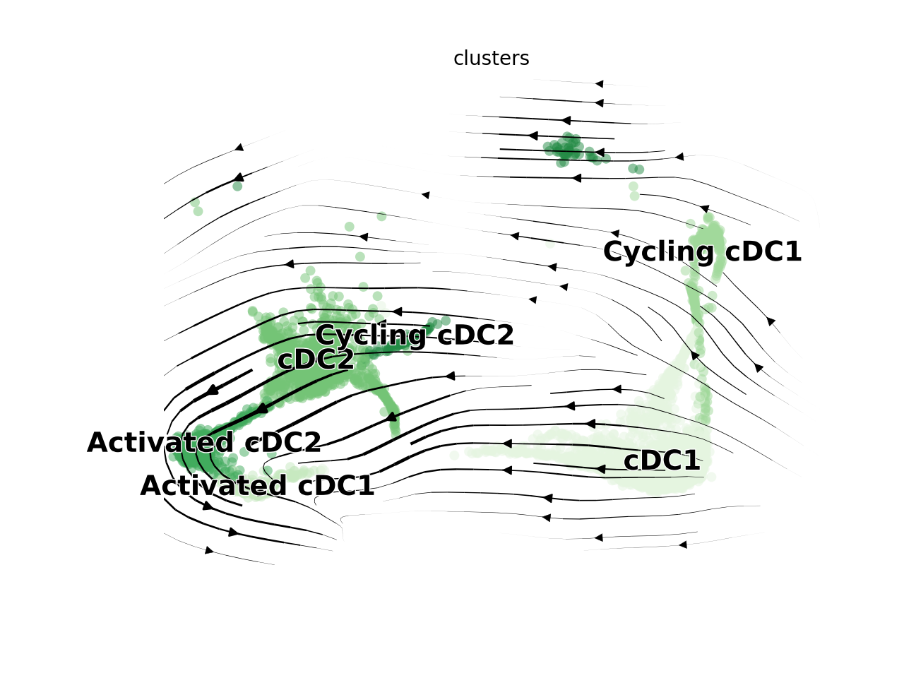

# Setup

```{r prep, warning=FALSE, message=FALSE}
library(Seurat)
library(RColorBrewer)
library(ggplot2)
library(dplyr)
library(ggpubr)
library(SingleCellExperiment)
library(DESeq2)
library(Matrix.utils)
library(magrittr)
library(stringr)
library(pheatmap)
library(tibble)
library(purrr)
library(tidyr)
library(DEGreport)
library(ggrepel)
library(reticulate)
library(viridis)

#Data file
data.integrated <- readRDS("../Inputs/IntegratedData.rds")

#Color panels
maccols <- brewer.pal(n=8, name="Blues")[c(-1,-3,-5,-7)]
monocols <- c("#ff8ade","#e324ad")
dccols <- brewer.pal(n=9, name="Greens")[-1]
tcols <- brewer.pal(n=8, name="Reds")[-1]
nkcols <- c("#876149","#6e3f22")
bcols <- brewer.pal(n=4, name="Purples")[-1]
othcols <- c("#71a157","#00c5cc","#a18e25","#b282b3")
strcols <- brewer.pal(n=4, name="Oranges")[-1]
wccols = c("#878787", "#518db6","#94cc73","#e96b53")

cols <- c(maccols,monocols,dccols,tcols,nkcols,bcols,othcols,strcols)

llcols <- c("#4292C6","#ff8ade","#238B45","#EF3B2C","#876149","#9E9AC8","#71a157","#00c5cc","#a18e25","#b282b3","#FD8D3C")

#Calculate cellspm
cellspm <- table(data.integrated$individual_mice, data.integrated$highlevel2)
propcellspm <- prop.table(cellspm, margin=1)
#Convert to a dataframe
cellspm <- as.data.frame(cellspm)
propcellspm <- as.data.frame(propcellspm)
#Change column names
colnames(cellspm) <- c("Mouse","Cluster","Counts")
colnames(propcellspm) <- c("Mouse","Cluster","Frequency")
#Add a column indicating the groups to each table
cellspm$Group <- gsub("_Hashtag.","", cellspm$Mouse)
propcellspm$Group <- gsub("_Hashtag.","", propcellspm$Mouse)
#Normalize "Counts" to "Counts per hundred cells sequenced"
cphc<-list()
cellspm <- cellspm %>% arrange(.,Mouse)
for (i in levels(cellspm$Mouse)){
  x <- sum(subset(cellspm, Mouse==i)$Counts)/100
  y <- subset(cellspm, Mouse==i)$Counts/x
  cphc <- append(cphc, y)
}
cellspm$CountsPerHundred <- as.numeric(cphc)
#Function to calculate standard error for each given variable (cell cluster)
 data_summary <- function(data, varname, groupnames){
  require(plyr)
  summary_func <- function(x, col){
    c(mean = mean(x[[col]], na.rm=TRUE),
      se = sd(x[[col]], na.rm=TRUE) / sqrt(sum(!is.na(x[[col]]))))
  }
  data_sum<-ddply(data, groupnames, .fun=summary_func,
                  varname)
names(data_sum)[names(data_sum) == 'mean'] <- varname
return(data_sum)
}
#Summarize the data
clustercounts <- data_summary(cellspm, varname="CountsPerHundred", groupnames=c("Group","Cluster"))
clusterprops <- data_summary(propcellspm, varname="Frequency", groupnames=c("Group","Cluster"))
```

# Figure 5

## Figure 5A

```{r Fig5A, echo=TRUE, fig.width=12, fig.height=4}
fig5cols <- c(rep("#e6e6e6",4),"#ff8ade","#e324ad","#E5F5E0","#C7E9C0","#A1D99B","#74C476","#41AB5D","#238B45","#006D2C","#00441B",rep("#e6e6e6",19))
DimPlot(data.integrated, split.by="orig.ident",group.by="highlevel2") + 
  NoLegend() + 
  labs(title="") &
  scale_color_manual(values=fig5cols) &
 NoAxes()
```

## Figure 5B

```{r Fig5Bsetup}
Monocytes <- subset(data.integrated, highlevel2=="Classical Monocytes" | highlevel2=="Non-classical Monocytes")
Monocytes$highlevel2 <- factor(Monocytes$highlevel2, levels=c("Classical Monocytes","Non-classical Monocytes"))
```

```{r Fig5B, fig.width=6, fig.height=5.5}
Idents(Monocytes) <- Monocytes$highlevel2
DefaultAssay(Monocytes) <- "RNA"
VlnPlot(Monocytes, 
        features=c("Lyz2","Lst1","Plac8","Fcgr1","Ly6c2","Ccr2","Cd14","Ear2","Cx3cr1","Ace"), 
        stack=T, 
        flip=T,
        fill.by="ident",
        cols=c("#ff8ade","#e324ad","#00441B","#E5F5E0","#74C476")) +
  labs(x="") + 
  NoLegend() +
  theme(aspect.ratio = 0.25) + 
  scale_x_discrete(labels=c("Classical","Non-classical"))
```

## Figure 5C

```{r Fig5Csetup, echo=TRUE}
monocellspm <- subset(cellspm, 
                          Cluster=="Classical Monocytes" | 
                          Cluster=="Non-classical Monocytes" )
monocellspm$Group <- factor(monocellspm$Group, levels = c("Lean","Obese","WL","WC"))
monoclustercounts <- subset(clustercounts, 
                            Cluster=="Classical Monocytes" | 
                            Cluster=="Non-classical Monocytes")
monoclustercounts$Group <- factor(monoclustercounts$Group, levels = c("Lean","Obese","WL","WC"))
```

```{r Fig5Cstats, echo=TRUE, fig.width=3, fig.height=3}
#T tests with bonferroni correction are used here comparing all groups to the reference lean control group.
compare_means(CountsPerHundred ~ Group, data = subset(monocellspm, Cluster=="Classical Monocytes"), method="t.test", p.adjust.method = "bonferroni", ref.group="Lean")

compare_means(CountsPerHundred ~ Group, data = subset(monocellspm, Cluster=="Non-classical Monocytes"), method="t.test", p.adjust.method = "bonferroni", ref.group="Lean")
```

```{r Fig5C, echo=TRUE, fig.width=3, fig.height=3}
ggboxplot(d=subset(monocellspm, Cluster=="Classical Monocytes"), 
          x="Group", 
          y="CountsPerHundred",  
          fill="Group", 
          facet.by="Cluster", 
          add = "mean_se")  +
    theme_classic() +
    scale_fill_manual(values=wccols) +
    theme(axis.text.y=element_text(face="bold", size=10)) + 
    labs(x="", y="") +
    theme(axis.text.x = element_blank(), axis.ticks = element_blank(), strip.text = element_text(face="bold", size=10)) +
    facet_wrap(~Cluster) + 
    NoLegend() + 
    ylim(0,20)
ggboxplot(d=subset(monocellspm, Cluster=="Non-classical Monocytes"), 
          x="Group", 
          y="CountsPerHundred",  
          fill="Group", 
          facet.by="Cluster", 
          add = "mean_se") +
    theme_classic() +
    scale_fill_manual(values=wccols) +
    theme(axis.text.y=element_text(face="bold", size=10)) + 
    labs(x="", y="") +
    theme(axis.text.x = element_blank(), axis.ticks = element_blank(), strip.text = element_text(face="bold", size=10)) +
    facet_wrap(~Cluster) + 
    NoLegend() + 
    ylim(0,5)
#Just for the legend
ggboxplot(d=subset(monocellspm, Cluster=="Non-classical Monocytes"), 
          x="Group", 
          y="CountsPerHundred",  
          fill="Group", 
          facet.by="Cluster", 
          add = "mean_se") +
    theme_classic() +
    scale_fill_manual(values=wccols) +
    theme(axis.text.x=element_text(face="bold", size=10)) + 
    labs(x="", y="") +
    theme(axis.text.x = element_blank(), axis.ticks = element_blank()) +
    facet_wrap(~Cluster) +
    ylim(0,5)
```

## Figure 5D

```{r Fig5Dsetup}
#Convert Seurat Object into a SingleCellExperiment object
counts <- data.integrated@assays$RNA@counts #Raw counts
metadata <- data.integrated@meta.data[,c("orig.ident","HTO_maxID","HTO_classification.global","lowlevel2","highlevel2","individual_mice")] #metadata
metadata$individual_mice <- gsub("_","",metadata$individual_mice)
sce <- SingleCellExperiment(assays=list(counts=counts), colData = metadata)

#Identify Groups to aggregate counts from
groups <- colData(sce)[, c("lowlevel2", "individual_mice")]

#Aggregrate across cluster-sample groups
pb <- aggregate.Matrix(t(counts(sce)),
                       groupings = groups, fun = "sum")

#Create a vector to split samples. 
splitf <- sapply(stringr::str_split(rownames(pb), 
                                    pattern = "_",  
                                    n = 2), 
                 `[`, 1)

#Split matrix into a list containing components for each cluster and transpose
pb <- split.data.frame(pb, 
                       factor(splitf)) %>%
        lapply(function(u) 
                set_colnames(t(u), 
                             stringr::str_extract(rownames(u), "(?<=_)[:alnum:]+")))

#Create vectors containing sample information
clusters <- purrr::set_names(levels(sce$lowlevel2))
n_clusters <- length(clusters)
samples <- purrr::set_names(levels(factor(sce$individual_mice)))
n_samples <- length(samples)

#Collect sample metadata
n_cells <- as.numeric(table(sce$individual_mice))
m <- match(samples, sce$individual_mice)
ei <- data.frame(colData(sce)[m,],
                 n_cells, row.names=NULL) %>%
  select(-"lowlevel2")

#Create a table to see how many cells belong to each grouping
data.frame(table(sce$individual_mice, sce$lowlevel2)) %>% 'colnames<-'(c("Sample","Subcluster","# Cells")) %>% tibble()

#Generate sample-level metadata 
metadata <- unique(data.frame(metadata$lowlevel2, metadata$individual_mice, metadata$orig.ident)) %>% 'colnames<-'(c("cluster_id","sample_id","group_id"))

#Vector of cluster IDs
clusters <- levels(metadata$cluster_id)

#Subset for the group of interest
cluster_metadata <- metadata[which(metadata$cluster_id == "Monocytes"), ]
rownames(cluster_metadata) <- cluster_metadata$sample_id
counts <- pb$`Monocytes`
cluster_counts <- data.frame(counts[, which(colnames(counts) %in% rownames(cluster_metadata))])
cluster_metadata <- cluster_metadata[match(colnames(cluster_counts),cluster_metadata$sample_id),]
all(rownames(cluster_metadata) == colnames(cluster_counts))     

#Create the DESeq2 data object
dds <- DESeqDataSetFromMatrix(countData=round(cluster_counts), 
                              colData = cluster_metadata, 
                              design = ~ group_id)

#Set obese as the reference control. We are using LRT insteaed of Wald, so this doesn't really matter.
dds$group_id <- relevel(dds$group_id, ref="Obese")
rld <- rlog(dds, blind=TRUE)

#Plot PCA
DESeq2::plotPCA(rld, intgroup = "group_id")

#Plot heatmap
rld_mat <- assay(rld)
rld_cor <- cor(rld_mat)
pheatmap(rld_cor, annotation = cluster_metadata[, c("group_id"), drop=F])

#Run LRT testing via DESeq2
dds <- DESeq(dds, test = "LRT", reduced=~1)

#plot dispersion
plotDispEsts(dds)

#Define contrasts. LRT compares across all groups, so this isn't necessary either.
contrast <- c("group_id", levels(cluster_metadata$group_id)[1], levels(cluster_metadata$group_id)[2])

#Generate DE results
res <- results(dds, 
               contrast = contrast,
               alpha = 0.05)
res_tbl <- res %>%
        data.frame() %>%
        rownames_to_column(var="gene") %>%
        as_tibble()

#Filter the results, keeping only significant genes
padj_cutoff <- 0.05
sig_res <- dplyr::filter(res_tbl, padj < padj_cutoff) %>%
        dplyr::arrange(padj)

#Normalize the counts for all genes
normalized_counts <- counts(dds, 
                            normalized = TRUE)

#Plot the top 20 genes
top20_sig_genes <- sig_res %>%
        dplyr::arrange(padj) %>%
        dplyr::pull(gene) %>%
        head(n=20)
top20_sig_norm <- data.frame(normalized_counts) %>%
        rownames_to_column(var = "gene") %>%
        dplyr::filter(gene %in% top20_sig_genes)

gathered_top20_sig <- top20_sig_norm %>%
        gather(colnames(top20_sig_norm)[2:length(colnames(top20_sig_norm))], key = "samplename", value = "normalized_counts")
        
gathered_top20_sig <- inner_join(ei[, c("individual_mice", "orig.ident" )], gathered_top20_sig, by = c("individual_mice" = "samplename"))
ggplot(gathered_top20_sig) +
        geom_point(aes(x = gene, 
                       y = normalized_counts, 
                       color = orig.ident), 
                   position=position_jitter(w=0.1,h=0)) +
        scale_y_log10() +
        xlab("Genes") +
        ylab("log10 Normalized Counts") +
        ggtitle("Top 20 Significant DE Genes") +
        theme_bw() +
        theme(axis.text.x = element_text(angle = 45, hjust = 1)) + 
        theme(plot.title = element_text(hjust = 0.5)) + 
        scale_color_manual(values=wccols)

#Use the degreport package to group genes by changes in patterns across groups. Normally this is for timecourse data, but works really effectively in our paradigm to look at genes that recover or fail to recover during WL.
cluster_rlog <- rld_mat[sig_res$gene, ]
metadata <- subset(metadata, cluster_id=="Monocytes")
rownames(metadata) <- metadata$sample_id
metadata <- metadata[match(colnames(cluster_rlog),cluster_metadata$sample_id),]
clusters <- degPatterns(cluster_rlog, metadata = metadata, time = "group_id", col=NULL, plot=FALSE)
```

```{r Fig5dpart1, fig.width=10, fig.height=2.5, message=TRUE, warning=TRUE}
ggplot(clusters$normalized, aes(x=group_id,y=value, color=group_id)) + 
  stat_smooth(aes(x=group_id, y=value))+
  geom_point(alpha=0.5, size=1, position=position_jitterdodge(dodge.width = 0.9)) + 
  geom_line(aes(group=genes), alpha=0.1) + 
  geom_boxplot(alpha=0, outlier.size=0, outlier.shape=NA)+
  facet_wrap(~cluster, ncol=4) +
  theme_pubr(base_size = 12) + 
  labs(y="Z-score of gene abundance") +
  scale_color_manual(values=wccols)+
  theme(axis.title.x=element_blank()) +
  NoLegend()
#Gene clusters:
  # 1 = Lean-associated genes that recover with WL
  # 2 = Obese-associated genes that do not recover with WL
  # 3 = Obese-associated genes that recover with WL
  # 4 = Obese-associated genes that do not recover with WL
  # 5 = Lean-associated genes that do not recover with WL
  # 6 = Lean-associated genes that do not recover with WL
  # 7 = Obese-associated genes that do not recover with WL

#Regroups clusters by the above simplified patterns into.

Monocyte_DEG_patterns <- clusters$normalized %>% mutate(patterns = ifelse(cluster==1, 1, #Highest in lean, recover with WL
                                                                   ifelse(cluster==3,2, #Lowest in lean, recover with WL
                                                                   ifelse(cluster==2 | cluster==4 | cluster==7,4, #lowest in lean, don't recover with WL
                                                                   ifelse(cluster==5|cluster==6,3,""))))) #highest in lean, don't recover with WL

ggplot(Monocyte_DEG_patterns, aes(x=group_id,y=value, color=group_id)) + 
  stat_smooth(aes(x=group_id, y=value))+
  geom_point(alpha=0.5, size=0.5, position=position_jitterdodge(dodge.width = 0.9)) + 
  geom_line(aes(group=genes), alpha=0.1) + 
  geom_boxplot(alpha=0, outlier.size=0, outlier.shape=NA)+
  facet_wrap(~patterns, ncol=4) +
  theme_pubr(base_size = 12) + 
  labs(y="Z-score of gene abundance") +
  scale_color_manual(values=wccols)+
  theme(strip.background = element_blank(), strip.text.x=element_blank(), axis.title.x=element_blank()) +
  NoLegend()

#To save genes for putting into Metascape
#write.csv(data.frame(Monocyte_DEG_patterns$genes, Monocyte_DEG_patterns$patterns) %>% unique() %>%  'colnames<-'(c("genes","patterns")), file="Monocyte_metascape.csv")
```

```{r Fig5dpart2, fig.width=2.5, fig.height=2.5}
#Ran these through metascape for gene ontology
Pattern1 <- read.csv("../Inputs/Fig5/Monocyte_Pattern_A/Enrichment_GO/_FINAL_GO.csv")
Pattern2 <- read.csv("../Inputs/Fig5/Monocyte_Pattern_B/Enrichment_GO/_FINAL_GO.csv")
Pattern3 <- read.csv("../Inputs/Fig5/Monocyte_Pattern_C/Enrichment_GO/_FINAL_GO.csv")
Pattern4 <- read.csv("../Inputs/Fig5/Monocyte_Pattern_D/Enrichment_GO/_FINAL_GO.csv")
  
#We will plot the top5 pathways for each pattern
top_pathways_1 <- subset(Pattern1,FirstInGroupByEnrichment==1)
top_pathways_1$GO <- factor(top_pathways_1$GO, levels = top_pathways_1$GO[order(top_pathways_1$Log.q.value.)])
top_pathways_1 <- top_pathways_1 %>% distinct(Description,.keep_all = TRUE)
ggplot(top_pathways_1[1:5,],aes(x=-Log.q.value., y=rev(GO), color=Log.q.value., label=stringr::str_wrap(Description,30)))+
  geom_point(size=4) + 
  labs(x="-log10(adj P value)",y="") + 
  theme_pubr(base_size=10) + 
  theme(axis.text.y = element_blank(), axis.ticks.y = element_blank()) + 
  xlim(0,30) +
  scale_color_gradient(high="#d16f6f",low="#960000") +
  NoLegend() +
  geom_text_repel(nudge_x = 1,nudge_y = 0.55, size=3, min.segment.length = 0.001) +
  geom_vline(xintercept=-log10(0.01), color="grey",linetype="dashed")

top_pathways_2 <- subset(Pattern2,FirstInGroupByEnrichment==1)
top_pathways_2$GO <- factor(top_pathways_2$GO, levels = top_pathways_2$GO[order(top_pathways_2$Log.q.value.)])
top_pathways_2 <- top_pathways_2 %>% distinct(Description,.keep_all = TRUE)
ggplot(top_pathways_2[1:5,],aes(x=-Log.q.value., y=rev(GO), color=Log.q.value., label=stringr::str_wrap(Description,20)))+
  geom_point(size=4) + 
  labs(x="-log10(adj P value)",y="") + 
  theme_pubr(base_size=10) + 
  theme(axis.text.y = element_blank(), axis.ticks.y = element_blank()) + 
  xlim(0,10) +
  scale_color_gradient(high="#d16f6f",low="#960000") +
  NoLegend() +
  geom_text_repel(nudge_x = 3,nudge_y = 0.33, size=3, min.segment.length = 0.001) +
  geom_vline(xintercept=-log10(0.01), color="grey",linetype="dashed")

top_pathways_3 <- subset(Pattern3,FirstInGroupByEnrichment==1)
top_pathways_3$GO <- factor(top_pathways_3$GO, levels = top_pathways_3$GO[order(top_pathways_3$Log.q.value.)])
top_pathways_3 <- top_pathways_3 %>% distinct(Description,.keep_all = TRUE)
ggplot(top_pathways_3[1:5,],aes(x=-Log.q.value., y=rev(GO), color=Log.q.value., label=stringr::str_wrap(Description,25)))+
  geom_point(size=4) + 
  labs(x="-log10(adj P value)",y="") + 
  theme_pubr(base_size=10) + 
  theme(axis.text.y = element_blank(), axis.ticks.y = element_blank()) + 
  xlim(0,10) +
  scale_color_gradient(high="#d16f6f",low="#960000") +
  NoLegend() +
  geom_text_repel(nudge_x = -4,nudge_y = 0.6, size=3, min.segment.length = 0.001) +
  geom_vline(xintercept=-log10(0.01), color="grey",linetype="dashed")

top_pathways_4 <- subset(Pattern4,FirstInGroupByEnrichment==1)
top_pathways_4$GO <- factor(top_pathways_4$GO, levels = top_pathways_4$GO[order(top_pathways_4$Log.q.value.)])
top_pathways_4 <- top_pathways_4 %>% distinct(Description,.keep_all = TRUE)
ggplot(top_pathways_4[1:5,],aes(x=-Log.q.value., y=rev(GO), color=Log.q.value., label=stringr::str_wrap(Description,20)))+
  geom_point(size=4) + 
  labs(x="-log10(adj P value)",y="") + 
  theme_pubr(base_size=10) + 
  theme(axis.text.y = element_blank(), axis.ticks.y = element_blank()) + 
  xlim(0,30) +
  scale_color_gradient(high="#d16f6f",low="#960000") +
  NoLegend() +
  geom_text_repel(nudge_x = -6,nudge_y = 0.5, size=3, min.segment.length = 0.001) +
  geom_vline(xintercept=-log10(0.01), color="grey",linetype="dashed")
```

## Figure 5E

```{r Fig5esetup}
Fig5DCs <- subset(data.integrated, highlevel2=="cDC1" | highlevel2=="Activated cDC1" | highlevel2=="Cycling cDC1" |  highlevel2=="cDC2" | highlevel2=="Activated cDC2" | highlevel2=="Cycling cDC2" | highlevel2=="pDCs" | highlevel2=="moDCs")
```

```{r Fig5e, fig.width=6, fig.height=6}
Idents(Fig5DCs) <- Fig5DCs$highlevel2
DefaultAssay(Fig5DCs) <- "RNA"
VlnPlot(Fig5DCs, 
        features=c("Cst3","Clec9a","Xcr1","Sirpa","Cd209a","Stmn1","Pclaf","Siglech","Ear2"), 
        stack=T, 
        flip=T,
        fill.by="ident",
        cols=c("#E5F5E0","#C7E9C0","#A1D99B","#74C476","#41AB5D","#238B45","#006D2C","#00441B")) +
  labs(x="") + 
  NoLegend() +
  theme(aspect.ratio = 0.25) 
```


## Figure 5F

```{r Fig5fsetup, echo=TRUE}
dccomps <- list(c("Lean","WL"),c("Lean","Obese"),c("Obese","WC"))
DCscellspm <- subset(cellspm, 
                          Cluster=="cDC1" | 
                          Cluster=="Activated cDC1" | 
                          Cluster=="Cycling cDC1" |
                          Cluster=="cDC2" |
                          Cluster=="Activated cDC2" | 
                          Cluster=="Cycling cDC2" |
                          Cluster=="moDCs" | 
                          Cluster=="pDCs")
DCscellspm$Group <- factor(DCscellspm$Group, levels = c("Lean","Obese","WL","WC"))
DCsclustercounts <- subset(clustercounts, 
              Cluster=="cDC1" | 
              Cluster=="Activated cDC1" |
              Cluster=="Cycling cDC1" |
              Cluster=="cDC2" |
              Cluster=="Activated cDC2" |
              Cluster=="Cycling cDC2" |
              Cluster=="moDCs" | 
              Cluster=="pDCs")
DCsclustercounts$Group <- factor(DCsclustercounts$Group, levels = c("Lean","Obese","WL","WC"))
```

```{r Fig5fstats, echo=TRUE, warning=FALSE, message=FALSE, fig.width=3, fig.height=3}
#T-test with bonferroni correction for multiple comparisons was used to compare all groups to the Lean reference control.
compare_means(CountsPerHundred ~ Group, data = subset(DCscellspm, Cluster=="cDC1"), method="t.test", p.adjust.method = "bonferroni", ref.group="Lean")

compare_means(CountsPerHundred ~ Group, data = subset(DCscellspm, Cluster=="Activated cDC1"), method="t.test", p.adjust.method = "bonferroni", ref.group="Lean")

compare_means(CountsPerHundred ~ Group, data = subset(DCscellspm, Cluster=="Cycling cDC1"), method="t.test", p.adjust.method = "bonferroni", ref.group="Lean")

compare_means(CountsPerHundred ~ Group, data = subset(DCscellspm, Cluster=="cDC2"), method="t.test", p.adjust.method = "bonferroni", ref.group="Lean")

compare_means(CountsPerHundred ~ Group, data = subset(DCscellspm, Cluster=="Activated cDC2"), method="t.test", p.adjust.method = "bonferroni", ref.group="Lean")

compare_means(CountsPerHundred ~ Group, data = subset(DCscellspm, Cluster=="Cycling cDC2"), method="t.test", p.adjust.method = "bonferroni", ref.group="Lean")

compare_means(CountsPerHundred ~ Group, data = subset(DCscellspm, Cluster=="moDCs"), method="t.test", p.adjust.method = "bonferroni", ref.group="Lean")

compare_means(CountsPerHundred ~ Group, data = subset(DCscellspm, Cluster=="pDCs"), method="t.test", p.adjust.method = "bonferroni", ref.group="Lean")
```

```{r Fig5f, echo=TRUE, warning=FALSE, message=FALSE, fig.width=3, fig.height=3}
ggboxplot(d=subset(DCscellspm, Cluster=="cDC1"), 
          x="Group", 
          y="CountsPerHundred",  
          fill="Group", 
          facet.by="Cluster", 
          add = "mean_se") + 
    theme_classic() +
    scale_fill_manual(values=wccols) +
    theme(axis.text.y=element_text(face="bold", size=10), strip.text = element_text(face="bold",size=10)) + 
    labs(x="", y="") +
    theme(axis.text.x = element_blank(), axis.ticks = element_blank()) +
    facet_wrap(~Cluster) + 
    NoLegend() + 
    ylim(0,10)

ggboxplot(d=subset(DCscellspm, Cluster=="Activated cDC1"), 
          x="Group", 
          y="CountsPerHundred",  
          fill="Group", 
          facet.by="Cluster", 
          add = "mean_se") +
    theme_classic() +
    scale_fill_manual(values=wccols) +
    theme(axis.text.y=element_text(face="bold", size=10), strip.text = element_text(face="bold",size=10)) +
    labs(x="", y="") +
    theme(axis.text.x = element_blank(), axis.ticks = element_blank()) +
    facet_wrap(~Cluster) + 
    NoLegend() + 
    ylim(0,2)
ggboxplot(d=subset(DCscellspm, Cluster=="Cycling cDC1"), 
          x="Group", 
          y="CountsPerHundred",  
          fill="Group", 
          facet.by="Cluster", 
          add = "mean_se")   +
    theme_classic() +
    scale_fill_manual(values=wccols) +
    theme(axis.text.y=element_text(face="bold", size=10), strip.text = element_text(face="bold",size=10)) + 
    labs(x="", y="") +
    theme(axis.text.x = element_blank(), axis.ticks = element_blank()) +
    facet_wrap(~Cluster) + 
    NoLegend() + 
    ylim(0,2)
ggboxplot(d=subset(DCscellspm, Cluster=="cDC2"), 
          x="Group", 
          y="CountsPerHundred",  
          fill="Group", 
          facet.by="Cluster", 
          add = "mean_se") +
    theme_classic() +
    scale_fill_manual(values=wccols) +
    theme(axis.text.y=element_text(face="bold", size=10), strip.text = element_text(face="bold",size=10)) +
    labs(x="", y="") +
    theme(axis.text.x = element_blank(), axis.ticks = element_blank()) +
    facet_wrap(~Cluster) + 
    NoLegend() + 
    ylim(0,6)
ggboxplot(d=subset(DCscellspm, Cluster=="Activated cDC2"), 
          x="Group", 
          y="CountsPerHundred",  
          fill="Group", 
          facet.by="Cluster", 
          add = "mean_se")   +
    theme_classic() +
    scale_fill_manual(values=wccols) +
    theme(axis.text.y=element_text(face="bold", size=10), strip.text = element_text(face="bold",size=10)) +
    labs(x="", y="") +
    theme(axis.text.x = element_blank(), axis.ticks = element_blank()) +
    facet_wrap(~Cluster) + 
    NoLegend() + 
    ylim(0,3)
ggboxplot(d=subset(DCscellspm, Cluster=="Cycling cDC2"), 
          x="Group", 
          y="CountsPerHundred",  
          fill="Group", 
          facet.by="Cluster", 
          add = "mean_se")   +
    theme_classic() +
    scale_fill_manual(values=wccols) +
    theme(axis.text.y=element_text(face="bold", size=10), strip.text = element_text(face="bold",size=10)) +
    labs(x="", y="") +
    theme(axis.text.x = element_blank(), axis.ticks = element_blank()) +
    facet_wrap(~Cluster) + 
    NoLegend() + 
    ylim(0,1)
ggboxplot(d=subset(DCscellspm, Cluster=="moDCs"), 
          x="Group", 
          y="CountsPerHundred",  
          fill="Group", 
          facet.by="Cluster", 
          add = "mean_se") + 
    theme_classic() +
    scale_fill_manual(values=wccols) +
    theme(axis.text.y=element_text(face="bold", size=10), strip.text = element_text(face="bold",size=10)) + 
    labs(x="", y="") +
    theme(axis.text.x = element_blank(), axis.ticks = element_blank()) +
    facet_wrap(~Cluster) + 
    NoLegend() + 
    ylim(0,8)
ggboxplot(d=subset(DCscellspm, Cluster=="pDCs"), 
          x="Group", 
          y="CountsPerHundred",  
          fill="Group", 
          facet.by="Cluster", 
          add = "mean_se") + 
    theme_classic() +
    scale_fill_manual(values=wccols) +
    theme(axis.text.y=element_text(face="bold", size=10), strip.text = element_text(face="bold",size=10)) + 
    labs(x="", y="") +
    theme(axis.text.x = element_blank(), axis.ticks = element_blank()) +
    facet_wrap(~Cluster) + 
    NoLegend() + 
    ylim(0,1)
```

## Figure 5G

```{r Fig5Gsetup}
Fig5DCs <- subset(data.integrated, highlevel2=="cDC1" | highlevel2=="Activated cDC1" | highlevel2=="Cycling cDC1" |  highlevel2=="cDC2" | highlevel2=="Activated cDC2" | highlevel2=="Cycling cDC2" | highlevel2=="pDCs" | highlevel2=="moDCs")
```

```{r Fig5G, fig.width=6, fig.height=6}
Idents(Fig5DCs) <- Fig5DCs$highlevel2
DefaultAssay(Fig5DCs) <- "RNA"
VlnPlot(Fig5DCs, 
        features=c("Ccr7","Mreg","Fscn1","Il15ra","Il12b","Fabp5","Ldha"), 
        stack=T, 
        flip=T,
        fill.by="ident",
        cols=c("#E5F5E0","#C7E9C0","#A1D99B","#74C476","#41AB5D","#238B45","#006D2C","#00441B")) +
  labs(x="") + 
  NoLegend() +
  theme(aspect.ratio = 0.3) 
```

## Figure 5H

For plotting rna velocity, I have a conda env containing scvelo (v0.2.3) and scanpy (v1.7.2).
Knitting this whole file takes >~8gb of RAM. I've set `eval=FALSE` in the chunk options so that I can knit this on my local machine quickly. For running this fresh, just change to `eval=TRUE`.
```{r Fig5hsetup, echo=TRUE, eval=FALSE}
#Prep environment for reticulate (i.e. we are running Python through R)
use_condaenv("r-velocity", required = TRUE)
conda_list()
scv <- import("scvelo")
scanpy <- import("scanpy")
matplotlib <- import("matplotlib")
plt <- import("matplotlib.pyplot", as = "plt")

#Subset for cDC clusters
Idents(data.integrated) <- data.integrated$lowlevel2
DCvelo <- subset(data.integrated, idents=c("Dendritic Cells"))
Idents(DCvelo) <- DCvelo$highlevel2
DCvelo <- subset(DCvelo, idents=c("cDC1","Activated cDC1","Cycling cDC1","cDC2","Activated cDC2","Cycling cDC2"))

#Create an adata object. Making this from pieces was the only way I could get it to work (Seurat -> adata conversion  is difficult).
spliced = DCvelo@assays$spliced@counts
unspliced = DCvelo@assays$unspliced@counts
row.num <- which(rownames(spliced) %in% rownames(DCvelo@assays$RNA@counts))
spliced <- spliced[c(row.num),]
unspliced <- unspliced[c(row.num),]
ad <- import("anndata", convert=FALSE)
orig.ident <- DCvelo$orig.ident
HTO_maxID <- DCvelo$HTO_maxID
lowlevel2 <- DCvelo$lowlevel2
highlevel2 <- DCvelo$highlevel2
clusters <- DCvelo$highlevel2
dfobs <- data.frame(orig.ident, HTO_maxID, lowlevel2, highlevel2, clusters)
rownames(dfobs) <- names(DCvelo$orig.barcodes)
genes_attributes <- rownames(DCvelo@assays$RNA@counts)
dfvar <- data.frame(genes_attributes)
rownames(dfvar) <- rownames(DCvelo@assays$RNA@counts)
emb <- Embeddings(DCvelo, "umap")
adata_DC <- ad$AnnData(
  X=t(DCvelo@assays$RNA@counts),
  obs=dfobs,
  var=dfvar,
  layers=list('spliced'=t(spliced), 'unspliced'=t(unspliced)),
  obsm=list('X_umap'=emb)) 
adata_DC

#Run through the scvelo pipeline and generate a dynamic velocity estimate.
scv$pp$filter_genes(adata_DC)
scv$pp$moments(adata_DC)
scv$tl$recover_dynamics(adata_DC)
scv$tl$velocity(adata_DC, mode='dynamical')
scv$tl$velocity_graph(adata_DC)

#Colors  for plot
DC.colors <- c("#E5F5E0","#C7E9C0","#A1D99B","#74C476","#41AB5D","#238B45")
```

```{r Fig5h, fig.width=5, fig.height=5, eval=FALSE}
#These will open a separate window because they run through reticulate. 

#save as "scvelo1.png" - This is already available in the "figures" folder.
scv$pl$velocity_embedding_stream(adata_DC, 
                                 basis='umap', 
                                 size=100,
                                 legend_fontsize=14, 
                                 palette=DC.colors,
                                 smooth=TRUE,
                                 min_mass=0,
                                 alpha=0.5)

```

```{r Fig5houts}

```


## Figure 5I

```{r Fig5i, fig.width=12, fig.height=6}
DCs <- subset(data.integrated,lowlevel2=="Dendritic Cells")

FeaturePlot(DCs, features=c("Cd274","Pdcd1lg2","Cd200"), split.by="orig.ident", by.col=T, pt.size=1, order=T) & theme_void() & NoLegend() & scale_color_viridis(option="D", limits=c(0,2)) & ylim(-10,3) & xlim(-7,7)

### for scale bar
FeaturePlot(DCs, features=c("Cd274","Pdcd1lg2","Cd200"), split.by="orig.ident", by.col=T, pt.size=0.5)  & scale_color_viridis(option="D", limits=c(0,2), breaks=c(0,1,2)) & ylim(-10,3) & xlim(-7,7) & theme(legend.position="bottom")

### Just using this for nice labels
VlnPlot(DCs, features=c("Cd274","Pdcd1lg2","Cd200"), stack=T, flip=T, split.by="orig.ident")
```

# Session Info
```{r si}
sessionInfo()
```

