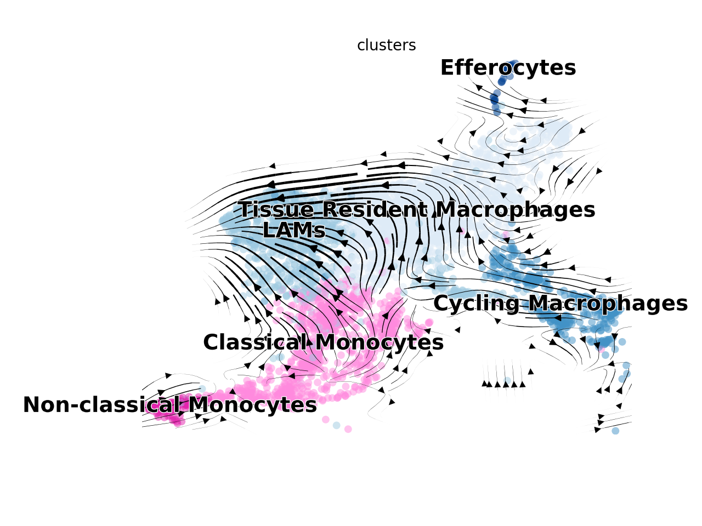
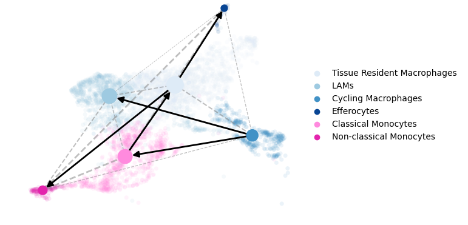

# Setup

```{r prep, warning=FALSE, message=FALSE}
library(Seurat)
library(RColorBrewer)
library(ggplot2)
library(dplyr)
library(ggpubr)
library(SingleCellExperiment)
library(DESeq2)
library(Matrix.utils)
library(magrittr)
library(stringr)
library(pheatmap)
library(tibble)
library(purrr)
library(tidyr)
library(DEGreport)
library(ggrepel)
library(reticulate)
library(viridis)

#Data file
data.integrated <- readRDS("../Inputs/IntegratedData.rds")

#Color panels
maccols <- brewer.pal(n=8, name="Blues")[c(-1,-3,-5,-7)]
monocols <- c("#ff8ade","#e324ad")
dccols <- brewer.pal(n=9, name="Greens")[-1]
tcols <- brewer.pal(n=8, name="Reds")[-1]
nkcols <- c("#876149","#6e3f22")
bcols <- brewer.pal(n=4, name="Purples")[-1]
othcols <- c("#71a157","#00c5cc","#a18e25","#b282b3")
strcols <- brewer.pal(n=4, name="Oranges")[-1]
wccols = c("#878787", "#518db6","#94cc73","#e96b53")

cols <- c(maccols,monocols,dccols,tcols,nkcols,bcols,othcols,strcols)

llcols <- c("#4292C6","#ff8ade","#238B45","#EF3B2C","#876149","#9E9AC8","#71a157","#00c5cc","#a18e25","#b282b3","#FD8D3C")

#Calculate cellspm
cellspm <- table(data.integrated$individual_mice, data.integrated$highlevel2)
propcellspm <- prop.table(cellspm, margin=1)
#Convert to a dataframe
cellspm <- as.data.frame(cellspm)
propcellspm <- as.data.frame(propcellspm)
#Change column names
colnames(cellspm) <- c("Mouse","Cluster","Counts")
colnames(propcellspm) <- c("Mouse","Cluster","Frequency")
#Add a column indicating the groups to each table
cellspm$Group <- gsub("_Hashtag.","", cellspm$Mouse)
propcellspm$Group <- gsub("_Hashtag.","", propcellspm$Mouse)
#Normalize "Counts" to "Counts per hundred cells sequenced"
cphc<-list()
cellspm <- cellspm %>% arrange(.,Mouse)
for (i in levels(cellspm$Mouse)){
  x <- sum(subset(cellspm, Mouse==i)$Counts)/100
  y <- subset(cellspm, Mouse==i)$Counts/x
  cphc <- append(cphc, y)
}
cellspm$CountsPerHundred <- as.numeric(cphc)
#Function to calculate standard error for each given variable (cell cluster)
 data_summary <- function(data, varname, groupnames){
  require(plyr)
  summary_func <- function(x, col){
    c(mean = mean(x[[col]], na.rm=TRUE),
      se = sd(x[[col]], na.rm=TRUE) / sqrt(sum(!is.na(x[[col]]))))
  }
  data_sum<-ddply(data, groupnames, .fun=summary_func,
                  varname)
names(data_sum)[names(data_sum) == 'mean'] <- varname
return(data_sum)
}
#Summarize the data
clustercounts <- data_summary(cellspm, varname="CountsPerHundred", groupnames=c("Group","Cluster"))
clusterprops <- data_summary(propcellspm, varname="Frequency", groupnames=c("Group","Cluster"))
```

# Figure 6

## Figure 6A

```{r Fig6A, echo=TRUE, fig.width=12, fig.height=4, warning=FALSE, message=FALSE}
Fig6cols <- c("#DEEBF7","#9ECAE1","#4292C6","#084594",rep("#e6e6e6",29))
DimPlot(data.integrated, split.by="orig.ident",group.by="highlevel2") + 
  NoLegend() + 
  labs(title="") &
  scale_color_manual(values=Fig6cols) &
 NoAxes()
```

## Figure 6B

```{r Fig6Bsetup, warning=FALSE, message=FALSE}
Fig6Macs <- subset(data.integrated, highlevel2=="Tissue Resident Macrophages" | highlevel2=="LAMs" | highlevel2=="Cycling Macrophages" | 
                   highlevel2=="Efferocytes")
```

```{r Fig6B, fig.width=6, fig.height=6, warning=FALSE, message=FALSE}
Idents(Fig6Macs) <- Fig6Macs$highlevel2
DefaultAssay(Fig6Macs) <- "RNA"
VlnPlot(Fig6Macs, 
        features=c("Lyz2","Cst3","Adgre1","Cd68","Lgals3","Fcgr1","Itgam", "adt_MAC2","adt_CD64","adt_CD11b"), 
        stack=T, 
        flip=T,
        fill.by="ident",
        cols=c("#DEEBF7","#9ECAE1","#4292C6","#084594")) +
  labs(x="") + 
  scale_x_discrete(labels=c("Tissue Resident","LAMs","Cycling","Efferocytes")) + 
  NoLegend() +
  theme(aspect.ratio = 0.25, strip.text=element_text(face="bold.italic"), text=element_text(size=14))
```

## Figure 6C

```{r Fig6Csetup, warning=FALSE, message=FALSE}
Fig6Macs <- subset(data.integrated, highlevel2=="Tissue Resident Macrophages" | highlevel2=="LAMs" | highlevel2=="Cycling Macrophages" | 
                   highlevel2=="Efferocytes")
```

```{r Fig6C, fig.width=6, fig.height=6, warning=FALSE, message=FALSE}
Idents(Fig6Macs) <- Fig6Macs$highlevel2
DefaultAssay(Fig6Macs) <- "RNA"
VlnPlot(Fig6Macs, 
        features=c("Klf4","Cbr2","Stab1","Trem2","Cd9","Rgs1","Stmn1","Pclaf","Saa3","Slpi"), 
        stack=T, 
        flip=T,
        fill.by="ident",
        cols=c("#DEEBF7","#9ECAE1","#4292C6","#084594")) +
  labs(x="") + 
  scale_x_discrete(labels=c("Tissue Resident","LAMs","Cycling","Efferocytes")) + 
  NoLegend() +
  theme(aspect.ratio = 0.25, strip.text=element_text(face="bold.italic"), text=element_text(size=14)) 
```

## Figure 6D

```{r Fig6dsetup, echo=TRUE, warning=FALSE, message=FALSE}
Idents(data.integrated) <- data.integrated$orig.ident
maccellspm <- subset(cellspm, 
                      Cluster=="Tissue Resident Macrophages" | 
                      Cluster=="LAMs" |
                      Cluster=="Cycling Macrophages" |
                      Cluster=="Efferocytes")
maccellspm$Group <- factor(maccellspm$Group, levels = c("Lean","Obese","WL","WC"))
macclustercounts <- subset(clustercounts, 
                      Cluster=="Tissue Resident Macrophages" | 
                      Cluster=="LAMs" |
                      Cluster=="Cycling Macrophages" |
                      Cluster=="Efferocytes")
macclustercounts$Group <- factor(macclustercounts$Group, levels = c("Lean","Obese","WL","WC"))
```

```{r Fig6dstats, echo=TRUE, fig.width=3, fig.height=3, warning=FALSE, message=FALSE}
compare_means(CountsPerHundred ~ Group, data = subset(maccellspm, Cluster=="Tissue Resident Macrophages"), method="t.test", p.adjust.method = "bonferroni")

compare_means(CountsPerHundred ~ Group, data = subset(maccellspm, Cluster=="LAMs"), method="t.test", p.adjust.method = "bonferroni")

compare_means(CountsPerHundred ~ Group, data = subset(maccellspm, Cluster=="Cycling Macrophages"), method="t.test", p.adjust.method = "bonferroni")

compare_means(CountsPerHundred ~ Group, data = subset(maccellspm, Cluster=="Efferocytes"), method="t.test", p.adjust.method = "bonferroni")
```

```{r Fig6d, echo=TRUE, fig.width=3, fig.height=3, warning=FALSE, message=FALSE}
ggboxplot(d=subset(maccellspm, Cluster=="Tissue Resident Macrophages"), 
          x="Group", 
          y="CountsPerHundred",  
          fill="Group", 
          facet.by="Cluster", 
          add = "mean_se")  +
    theme_classic() +
    scale_fill_manual(values=wccols) +
    theme(axis.text.x=element_text(face="bold", size=10)) + 
    labs(x="", y="") +
    theme(axis.text.x = element_blank(), axis.ticks = element_blank()) +
    facet_wrap(~Cluster) + 
    NoLegend() + 
    ylim(0,40)
ggboxplot(d=subset(maccellspm, Cluster=="LAMs"), 
          x="Group", 
          y="CountsPerHundred",  
          fill="Group", 
          facet.by="Cluster", 
          add = "mean_se") +
    theme_classic() +
    scale_fill_manual(values=wccols) +
    theme(axis.text.x=element_text(face="bold", size=10)) + 
    labs(x="", y="") +
    theme(axis.text.x = element_blank(), axis.ticks = element_blank()) +
    facet_wrap(~Cluster) + 
    NoLegend() + 
    ylim(0,30)
ggboxplot(d=subset(maccellspm, Cluster=="Cycling Macrophages"), 
          x="Group", 
          y="CountsPerHundred",  
          fill="Group", 
          facet.by="Cluster", 
          add = "mean_se") +
    theme_classic() +
    scale_fill_manual(values=wccols) +
    theme(axis.text.x=element_text(face="bold", size=10)) + 
    labs(x="", y="") +
    theme(axis.text.x = element_blank(), axis.ticks = element_blank()) +
    facet_wrap(~Cluster) + 
    NoLegend() + 
    ylim(0,10)
ggboxplot(d=subset(maccellspm, Cluster=="Efferocytes"), 
          x="Group", 
          y="CountsPerHundred",  
          fill="Group", 
          facet.by="Cluster", 
          add = "mean_se") +
    theme_classic() +
    scale_fill_manual(values=wccols) +
    theme(axis.text.x=element_text(face="bold", size=10)) + 
    labs(x="", y="") +
    theme(axis.text.x = element_blank(), axis.ticks = element_blank()) +
    facet_wrap(~Cluster) + 
    NoLegend() + 
    ylim(0,2)
```

## Figure 6E

```{r Fig6e, fig.width=8, fig.height=2, results='hide', message=FALSE, warning=FALSE}
FeaturePlot(subset(data.integrated, highlevel2=="Tissue Resident Macrophages"), 
            features="Mrc1", 
            split.by="orig.ident", 
            min.cutoff="q10", 
            max.cutoff="q95") & 
  scale_color_viridis(option="D") & 
  theme_void() & 
  NoLegend() &
  xlim(-5,3) &
  ylim(1,9) 

FeaturePlot(subset(data.integrated, highlevel2=="Tissue Resident Macrophages"), 
            features="Cd163", 
            split.by="orig.ident", 
            min.cutoff="q10", 
            max.cutoff="q85") & 
  scale_color_viridis(option="D") & 
  theme_void() & 
  NoLegend() &
  xlim(-5,3) &
  ylim(1,9)

#For Labels
FeaturePlot(subset(data.integrated, highlevel2=="Tissue Resident Macrophages"), 
            features="Cd163", 
            min.cutoff="q10", 
            max.cutoff="q85") & 
  scale_color_viridis(option="D") & 
  xlim(-5,3) &
  ylim(1,9)
#For Labels
FeaturePlot(subset(data.integrated, highlevel2=="Tissue Resident Macrophages"), 
            features="Mrc1", 
            min.cutoff="q10", 
            max.cutoff="q95") & 
  scale_color_viridis(option="D") & 
  xlim(-5,3) &
  ylim(1,9)
```

## Figure 6F

For plotting rna velocity, I have a conda env containing scvelo (v0.2.3) and scanpy (v1.7.2).
Knitting this whole file takes >~8gb of RAM. I've set `eval=FALSE` in the chunk options so that I can knit this on my local machine quickly. For running this fresh, just change to `eval=TRUE`.
```{r Fig6fsetup, eval = FALSE, warning=FALSE, message=FALSE}
#Prep environment for reticulate (i.e. we are running Python through R)
use_condaenv("r-velocity", required = TRUE)
conda_list()
scv <- import("scvelo")
scanpy <- import("scanpy")
matplotlib <- import("matplotlib")
plt <- import("matplotlib.pyplot", as = "plt")

#Subset for Macrophage/Monocytes clusters
Idents(data.integrated) <- data.integrated$lowlevel2
Macvelo <- subset(data.integrated, idents=c("Macrophages","Monocytes"))

#Subset for obese to reduce computation time. Looks similar for WL/WC; Lean does not have many LAMs, so trajectories did change.
Idents(Macvelo) <- Macvelo$orig.ident
Macvelo_obese <- subset(Macvelo, idents="Obese")

#To remove noise in the velocity embedding, I removed cells that were not on the same cluster trajectory (i.e. 100% disconnected).
Macvelo_cells <- CellSelector(DimPlot(Macvelo_obese))
Idents(Macvelo_obese, cells=Macvelo_cells) <- "keep"
Macvelo_obese <- subset(Macvelo_obese, idents="keep")
Idents(Macvelo_obese) <- Macvelo_obese$highlevel2

#Create adata object
spliced = Macvelo_obese@assays$spliced@counts
unspliced = Macvelo_obese@assays$unspliced@counts
row.num <- which(rownames(spliced) %in% rownames(Macvelo_obese@assays$RNA@counts))
spliced <- spliced[c(row.num),]
unspliced <- unspliced[c(row.num),]
ad <- import("anndata", convert=FALSE)
orig.ident <- Macvelo_obese$orig.ident
HTO_maxID <- Macvelo_obese$HTO_maxID
lowlevel2 <- Macvelo_obese$lowlevel2
highlevel2 <- Macvelo_obese$highlevel2
clusters <- Macvelo_obese$highlevel2
dfobs <- data.frame(orig.ident, HTO_maxID, lowlevel2, highlevel2, clusters)
rownames(dfobs) <- names(Macvelo_obese$orig.barcodes)
genes_attributes <- rownames(Macvelo_obese@assays$RNA@counts)
dfvar <- data.frame(genes_attributes)
rownames(dfvar) <- rownames(Macvelo_obese@assays$RNA@counts)
emb <- Embeddings(Macvelo_obese, "umap")
adata_Mac <- ad$AnnData(
  X=t(Macvelo_obese@assays$RNA@counts),
  obs=dfobs,
  var=dfvar,
  layers=list('spliced'=t(spliced), 'unspliced'=t(unspliced)),
  obsm=list('X_umap'=emb))
adata_Mac

#Run through the scvelo pipeline and generate a dynamic velocity estimate. This takes a long time.
scv$pp$filter_genes(adata_Mac)
scv$pp$moments(adata_Mac)
scv$tl$recover_dynamics(adata_Mac)
scv$tl$velocity(adata_Mac, mode='dynamical')
scv$tl$velocity_graph(adata_Mac)

#Run PAGA using the dynamic velocity estimates
scv$tl$paga(adata_Mac, groups='clusters')

#Colors  for plot
Mac.colors <- c("#DEEBF7","#9ECAE1","#4292C6","#084594","#ff8ade","#e324ad")

#Save the obese macrophage adata object
# adata_Mac$write('Reticulate/mac_obese_adata.h5ad',compression='gzip')
# adata = scv$read('Reticulate/mac_adata.h5ad')
```

```{r Fig6f, fig.width=5, fig.height=5,eval = FALSE, warning=FALSE, message=FALSE}
#These will open a separate window because they run through reticulate.

#save as "scvelo1.png" - This is already available in the "figures" folder.
scv$pl$velocity_embedding_stream(adata_Mac, 
                                 basis='umap', 
                                 size=100,
                                 legend_loc='none',
                                 #legend_fontsize=14,
                                 palette=Mac.colors,
                                 min_mass=0,
                                 smooth=TRUE,
                                 alpha=0.5)

#save as "scvelo2.png" - This is already available in the "figures" folder.
scv$pl$paga(adata_Mac, basis='umap', size=100, alpha=0.1,
             min_edge_width=2, node_size_scale=1.5)
```

```{r Fig6fout, warning=FALSE, message=FALSE}



```

## Figure 6G
In the original Figure 6 Panel G, we show only Tissue Resident Macrophages and LAMs. The code chunks below reproduce these, but also provide analysis of Efferocytes and Cycling Macrophages. In addition, we provide a code chunk for all macrophages grouped together with an additional modification to overlay gene expression on top of the MacSpectrum visualization.

Since we reproduce some of the work done for MacSpectrum and adapt it to our needs, we ask that you reach out to Dr. Beiyan Zhou and cite her lab's work if you would like to use the code in this section. 
```{r Fig6gSetup, warning=FALSE, message=FALSE}
### MacSpectrum source code was provided by Beiyan Zhou:
# Chuan Li, Antoine Menoret, Cullen Farragher, Zhengqing Ouyang, Christopher Bonin, Paul Holvoet, Anthony T. Vella, Beiyan Zhou.  Single cell transcriptomics-based MacSpectrum reveals novel macrophage activation signatures in diseases. JCI insight.  April 16 2019. PMID: 30990466.

Idents(data.integrated) <- data.integrated$orig.ident
LAMs_macspec <- subset(data.integrated, highlevel2=="LAMs")
TRMs_macspec <- subset(data.integrated, highlevel2=="Tissue Resident Macrophages")
Effs_macspec <- subset(data.integrated, highlevel2=="Efferocytes")
Cycls_macspec <- subset(data.integrated, highlevel2=="Cycling Macrophages")
all_macspec <- subset(data.integrated, lowlevel2=="Macrophages")
LAMs_counts <- as.data.frame(as.matrix(LAMs_macspec@assays$RNA@data)) %>%
    mutate_all(funs(as.numeric(.))) # Macspec needs numeric data
TRMs_counts <- as.data.frame(as.matrix(TRMs_macspec@assays$RNA@data)) %>%
    mutate_all(funs(as.numeric(.)))
Effs_counts <- as.data.frame(as.matrix(Effs_macspec@assays$RNA@data)) %>%
    mutate_all(funs(as.numeric(.)))
Cycls_counts <- as.data.frame(as.matrix(Cycls_macspec@assays$RNA@data)) %>%
    mutate_all(funs(as.numeric(.)))
all_counts <- as.data.frame(as.matrix(all_macspec@assays$RNA@data)) %>%
    mutate_all(funs(as.numeric(.)))

#MacSpectrum uses ENSEMBL IDs. We use a bioMart annotation to convert our gene names to ENSEMBL IDs.
anno <- read.delim("../Inputs/Fig6/gene_to_ENS.tsv",as.is=T)
genes <- as.data.frame(rownames(LAMs_counts)) 
colnames(genes) <- "Gene.name"
#We lose a few genes that are not linked properly to their ENSEMBL id, and also some that are duplicated.
genes <- left_join(genes, anno) %>% drop_na() %>% distinct(Gene.stable.ID,.keep_all = TRUE) %>% distinct(Gene.name, .keep_all=TRUE)

LAMs_counts <- LAMs_counts[genes$Gene.name,]
rownames(LAMs_counts) <- genes[match(genes$Gene.name, rownames(LAMs_counts)),]$Gene.stable.ID

TRMs_counts <- TRMs_counts[genes$Gene.name,] 
rownames(TRMs_counts) <- genes[match(genes$Gene.name, rownames(TRMs_counts)),]$Gene.stable.ID

Effs_counts <- Effs_counts[genes$Gene.name,] 
rownames(Effs_counts) <- genes[match(genes$Gene.name, rownames(Effs_counts)),]$Gene.stable.ID

Cycls_counts <- Cycls_counts[genes$Gene.name,] 
rownames(Cycls_counts) <- genes[match(genes$Gene.name, rownames(Cycls_counts)),]$Gene.stable.ID

all_counts <- all_counts[genes$Gene.name,] 
rownames(all_counts) <- genes[match(genes$Gene.name, rownames(all_counts)),]$Gene.stable.ID

# Check to confirm that names of samples line up with their metadata
all(names(LAMs_macspec$individual_mice) == colnames(LAMs_counts)) 
all(names(TRMs_macspec$individual_mice) == colnames(TRMs_counts)) 
all(names(Effs_macspec$individual_mice) == colnames(Effs_macspec)) 
all(names(Cycls_macspec$individual_mice) == colnames(Cycls_counts)) 
all(names(all_macspec$individual_mice) == colnames(all_counts)) 

# Store metadata
LAM_groups <- unname(LAMs_macspec$individual_mice)
TRM_groups <- unname(TRMs_macspec$individual_mice)
Eff_groups <- unname(Effs_macspec$individual_mice)
Cycl_groups <- unname(Cycls_macspec$individual_mice)
all_groups <- unname(all_macspec$individual_mice)

# Read in the index information
M1_mean <- read.table("../Inputs/Fig6/BMDM_m1_mean.txt",sep=",",header=TRUE)
M2_mean <- read.table("../Inputs/Fig6/BMDM_m2_mean.txt",sep=",",header=TRUE)
M0_mean <- read.table("../Inputs/Fig6/BMDM_m0_mean.txt",sep=",",header=TRUE)
rownames(M1_mean) <- M1_mean$GeneID
rownames(M2_mean) <- M2_mean$GeneID
rownames(M0_mean) <- M0_mean$GeneID

# 
# # Save inputs - counts as a csv (instead of sparse matrix) are large.
# write.csv(LAMs_counts, file="MacSpectrum/input/LAM_genes-to-cells.csv")
# write.csv(TRMs_counts, file="MacSpectrum/input/TissueResMac_genes-to-cells.csv")
# write.csv(LAM_groups, file="MacSpectrum/input/LAM_group.csv")
# write.csv(TRM_groups, file="MacSpectrum/input/TissueResMac_group.csv")
```

```{r Fig6gLAM, fig.width=10, fig.height=3, warning=FALSE}
inFile <- LAMs_counts
inFile_feature <- LAM_groups
inFile <- inFile-rowMeans(inFile)

MPI_genes <- intersect(M1_mean$GeneID,rownames(inFile))
M1_mean <- M1_mean[MPI_genes,]
M2_mean <- M2_mean[MPI_genes,]
inFile_bak <- inFile
inFile <- inFile[MPI_genes,]

AMDI_genes <- intersect(M0_mean$GeneID,rownames(inFile_bak))
M0_mean <- M0_mean[AMDI_genes,]
inFile_m0 <- inFile_bak[AMDI_genes,]

#sigma of mac cells:
inFile_sigma <- 1:ncol(inFile)
total_gene_number <- nrow(inFile)
for(i in 1:ncol(inFile)) {
  options(digits=9)
  inFile_sigma[i] <- (sum(inFile[,i]^2)/total_gene_number)^0.5
  }

#sigma of mac cells for m0:
inFile_sigma_m0 <- 1:ncol(inFile_m0)
total_gene_number <- nrow(inFile_m0)
for(i in 1:ncol(inFile_m0)) {
	options(digits=9)
	inFile_sigma_m0[i] <- (sum(inFile_m0[,i]^2)/total_gene_number)^0.5
	}
	
#sigma of M0 mean:
total_gene_number <- nrow(M0_mean)
M0_sigma <- (sum(M0_mean$value^2)/total_gene_number)^0.5

#sigma of M1 mean:
total_gene_number <- nrow(M1_mean)
M1_sigma <- (sum(M1_mean$value^2)/total_gene_number)^0.5

#sigma of M2 mean:
total_gene_number <- nrow(M2_mean)
M2_sigma <- (sum(M2_mean$value^2)/total_gene_number)^0.5
	
#correlation of Mac  to M0 mean:
total_gene_number <- nrow(inFile_m0)
inFile_Pearson_per_cell_m0 <- 1:ncol(inFile_m0)
for (j in 1:ncol(inFile_m0)){
	inFile_Pearson_per_cell_m0[j] <- sum((inFile_m0[,j]/inFile_sigma_m0[j])*(M0_mean$value/M0_sigma))/total_gene_number
	}

#correlation of Mac  to M1 mean:
total_gene_number <- nrow(M2_mean)
inFile_Pearson_per_cell_m1 <- 1:ncol(inFile)
for (j in 1:ncol(inFile)){
	inFile_Pearson_per_cell_m1[j] <- sum((inFile[,j]/inFile_sigma[j])*(M1_mean$value/M1_sigma))/total_gene_number
	}

#correlation of ATM  to M2 mean:
total_gene_number <- nrow(M2_mean)
inFile_Pearson_per_cell_m2 <- 1:ncol(inFile)
for (j in 1:ncol(inFile)){
	inFile_Pearson_per_cell_m2[j] <- sum((inFile[,j]/inFile_sigma[j])*(M2_mean$value/M2_sigma))/total_gene_number
	}
	
a <- 0.991414467
b <- 1
c <- -0.0185412856 
x0 <- inFile_Pearson_per_cell_m1
y0 <- inFile_Pearson_per_cell_m2
d_sqr <- (a*x0+b*y0+c)^2/(a^2+b^2)
x_start <- -1
y_start <- (-a)*x_start+(-c)
x_end <- 1
y_end <- (-a)*x_end+(-c)

l <- ((x0-x_start)^2+(y0-y_start)^2-d_sqr)^0.5
l_max <- ((x_end-x_start)^2+(y_end-y_start)^2-d_sqr)^0.5
MPI <- (l-0)/(l_max-0)*100-50
AMDI <- -inFile_Pearson_per_cell_m0*50

mac_output <- data.frame(colnames(inFile),MPI,AMDI,inFile_feature,row.names=colnames(inFile))
colnames(mac_output) <- c("Samples","MPI","AMDI","Feature")

data.integrated$curr.barcodes <- rownames(data.integrated[[]])
LAMs_macspec <- left_join(x=mac_output,y=data.integrated[[c("curr.barcodes","orig.ident","HTO_maxID","lowlevel2" ,"highlevel2")]], by=c("Samples"="curr.barcodes"))

ggplot(LAMs_macspec, aes(x=MPI,y=AMDI,color=orig.ident)) + 
  geom_density_2d(alpha = 0.8) +
  geom_point(alpha = 0.5, size=0.05) +
  geom_vline(xintercept = 0) +
  geom_hline(yintercept = 0) + 
  labs(x="MPI",y="AMDI",title="LAMs") +
  theme_pubr(base_size=14) +
  NoLegend() +
  scale_color_manual(values=wccols) + 
  xlim(-16,16) + 
  ylim(-20,20) +
  facet_wrap(~orig.ident, ncol=4) 

# This is just a figure for the annotated regions
ggplot(LAMs_macspec, aes(x=MPI,y=AMDI,color=orig.ident)) + 
  annotate("rect",xmin=1, xmax=16, ymin=-20,ymax=-1, fill="yellow",color=NA, alpha=0.2) + 
  annotate("rect",xmin=1, xmax=16, ymin=1,ymax=20, fill="red",color=NA, alpha=0.2) + 
  annotate("rect",xmin=-16, xmax=-1, ymin=1,ymax=20, fill="green",color=NA, alpha=0.2) + 
  annotate("rect",xmin=-16, xmax=-1, ymin=-20,ymax=-1, fill="blue",color=NA, alpha=0.2) + 
	labs(x="MPI",y="AMDI",title="") +
  theme_pubr(base_size=14) +
  NoLegend() +
  xlim(-16,16) + 
  ylim(-20,20) +
  geom_vline(xintercept = 0) +
  geom_hline(yintercept = 0) + 
  theme(aspect.ratio=1)
```

```{r Fig6gTRM, fig.width=10, fig.height=3, warning=FALSE}
inFile <- TRMs_counts
inFile_feature <- TRM_groups
inFile <- inFile-rowMeans(inFile)

MPI_genes <- intersect(M1_mean$GeneID,rownames(inFile))
M1_mean <- M1_mean[MPI_genes,]
M2_mean <- M2_mean[MPI_genes,]
inFile_bak <- inFile
inFile <- inFile[MPI_genes,]

AMDI_genes <- intersect(M0_mean$GeneID,rownames(inFile_bak))
M0_mean <- M0_mean[AMDI_genes,]
inFile_m0 <- inFile_bak[AMDI_genes,]

#sigma of mac cells:
inFile_sigma <- 1:ncol(inFile)
total_gene_number <- nrow(inFile)
for(i in 1:ncol(inFile)) {
  options(digits=9)
  inFile_sigma[i] <- (sum(inFile[,i]^2)/total_gene_number)^0.5
  }

#sigma of mac cells for m0:
inFile_sigma_m0 <- 1:ncol(inFile_m0)
total_gene_number <- nrow(inFile_m0)
for(i in 1:ncol(inFile_m0)) {
	options(digits=9)
	inFile_sigma_m0[i] <- (sum(inFile_m0[,i]^2)/total_gene_number)^0.5
	}
	
#sigma of M0 mean:
total_gene_number <- nrow(M0_mean)
M0_sigma <- (sum(M0_mean$value^2)/total_gene_number)^0.5

#sigma of M1 mean:
total_gene_number <- nrow(M1_mean)
M1_sigma <- (sum(M1_mean$value^2)/total_gene_number)^0.5

#sigma of M2 mean:
total_gene_number <- nrow(M2_mean)
M2_sigma <- (sum(M2_mean$value^2)/total_gene_number)^0.5
	
#correlation of Mac  to M0 mean:
total_gene_number <- nrow(inFile_m0)
inFile_Pearson_per_cell_m0 <- 1:ncol(inFile_m0)
for (j in 1:ncol(inFile_m0)){
	inFile_Pearson_per_cell_m0[j] <- sum((inFile_m0[,j]/inFile_sigma_m0[j])*(M0_mean$value/M0_sigma))/total_gene_number
	}

#correlation of Mac  to M1 mean:
total_gene_number <- nrow(M2_mean)
inFile_Pearson_per_cell_m1 <- 1:ncol(inFile)
for (j in 1:ncol(inFile)){
	inFile_Pearson_per_cell_m1[j] <- sum((inFile[,j]/inFile_sigma[j])*(M1_mean$value/M1_sigma))/total_gene_number
	}

#correlation of ATM  to M2 mean:
total_gene_number <- nrow(M2_mean)
inFile_Pearson_per_cell_m2 <- 1:ncol(inFile)
for (j in 1:ncol(inFile)){
	inFile_Pearson_per_cell_m2[j] <- sum((inFile[,j]/inFile_sigma[j])*(M2_mean$value/M2_sigma))/total_gene_number
	}
	
a <- 0.991414467
b <- 1
c <- -0.0185412856 
x0 <- inFile_Pearson_per_cell_m1
y0 <- inFile_Pearson_per_cell_m2
d_sqr <- (a*x0+b*y0+c)^2/(a^2+b^2)
x_start <- -1
y_start <- (-a)*x_start+(-c)
x_end <- 1
y_end <- (-a)*x_end+(-c)

l <- ((x0-x_start)^2+(y0-y_start)^2-d_sqr)^0.5
l_max <- ((x_end-x_start)^2+(y_end-y_start)^2-d_sqr)^0.5
MPI <- (l-0)/(l_max-0)*100-50
AMDI <- -inFile_Pearson_per_cell_m0*50

mac_output <- data.frame(colnames(inFile),MPI,AMDI,inFile_feature,row.names=colnames(inFile))
colnames(mac_output) <- c("Samples","MPI","AMDI","Feature")

data.integrated$curr.barcodes <- rownames(data.integrated[[]])
TRMs_macspec <- left_join(x=mac_output,y=data.integrated[[c("curr.barcodes","orig.ident","HTO_maxID","lowlevel2" ,"highlevel2")]], by=c("Samples"="curr.barcodes"))

ggplot(TRMs_macspec, aes(x=MPI,y=AMDI,color=orig.ident)) + 
  geom_density_2d(alpha = 0.8) +
  geom_point(alpha = 0.5, size=0.05) +
  geom_vline(xintercept = 0) +
  geom_hline(yintercept = 0) + 
  labs(x="MPI",y="AMDI",title="TRMs") +
  theme_pubr(base_size=14) +
  NoLegend() +
  scale_color_manual(values=wccols) + 
  xlim(-16,16) + 
  ylim(-20,20) +
  facet_wrap(~orig.ident, ncol=4) 
```

```{r Fig6gEff, fig.width=10, fig.height=3, warning=FALSE}
inFile <- Effs_counts
inFile_feature <- Eff_groups
inFile <- inFile-rowMeans(inFile)

MPI_genes <- intersect(M1_mean$GeneID,rownames(inFile))
M1_mean <- M1_mean[MPI_genes,]
M2_mean <- M2_mean[MPI_genes,]
inFile_bak <- inFile
inFile <- inFile[MPI_genes,]

AMDI_genes <- intersect(M0_mean$GeneID,rownames(inFile_bak))
M0_mean <- M0_mean[AMDI_genes,]
inFile_m0 <- inFile_bak[AMDI_genes,]

#sigma of mac cells:
inFile_sigma <- 1:ncol(inFile)
total_gene_number <- nrow(inFile)
for(i in 1:ncol(inFile)) {
  options(digits=9)
  inFile_sigma[i] <- (sum(inFile[,i]^2)/total_gene_number)^0.5
  }

#sigma of mac cells for m0:
inFile_sigma_m0 <- 1:ncol(inFile_m0)
total_gene_number <- nrow(inFile_m0)
for(i in 1:ncol(inFile_m0)) {
	options(digits=9)
	inFile_sigma_m0[i] <- (sum(inFile_m0[,i]^2)/total_gene_number)^0.5
	}
	
#sigma of M0 mean:
total_gene_number <- nrow(M0_mean)
M0_sigma <- (sum(M0_mean$value^2)/total_gene_number)^0.5

#sigma of M1 mean:
total_gene_number <- nrow(M1_mean)
M1_sigma <- (sum(M1_mean$value^2)/total_gene_number)^0.5

#sigma of M2 mean:
total_gene_number <- nrow(M2_mean)
M2_sigma <- (sum(M2_mean$value^2)/total_gene_number)^0.5
	
#correlation of Mac  to M0 mean:
total_gene_number <- nrow(inFile_m0)
inFile_Pearson_per_cell_m0 <- 1:ncol(inFile_m0)
for (j in 1:ncol(inFile_m0)){
	inFile_Pearson_per_cell_m0[j] <- sum((inFile_m0[,j]/inFile_sigma_m0[j])*(M0_mean$value/M0_sigma))/total_gene_number
	}

#correlation of Mac  to M1 mean:
total_gene_number <- nrow(M2_mean)
inFile_Pearson_per_cell_m1 <- 1:ncol(inFile)
for (j in 1:ncol(inFile)){
	inFile_Pearson_per_cell_m1[j] <- sum((inFile[,j]/inFile_sigma[j])*(M1_mean$value/M1_sigma))/total_gene_number
	}

#correlation of ATM  to M2 mean:
total_gene_number <- nrow(M2_mean)
inFile_Pearson_per_cell_m2 <- 1:ncol(inFile)
for (j in 1:ncol(inFile)){
	inFile_Pearson_per_cell_m2[j] <- sum((inFile[,j]/inFile_sigma[j])*(M2_mean$value/M2_sigma))/total_gene_number
	}
	
a <- 0.991414467
b <- 1
c <- -0.0185412856 
x0 <- inFile_Pearson_per_cell_m1
y0 <- inFile_Pearson_per_cell_m2
d_sqr <- (a*x0+b*y0+c)^2/(a^2+b^2)
x_start <- -1
y_start <- (-a)*x_start+(-c)
x_end <- 1
y_end <- (-a)*x_end+(-c)

l <- ((x0-x_start)^2+(y0-y_start)^2-d_sqr)^0.5
l_max <- ((x_end-x_start)^2+(y_end-y_start)^2-d_sqr)^0.5
MPI <- (l-0)/(l_max-0)*100-50
AMDI <- -inFile_Pearson_per_cell_m0*50

mac_output <- data.frame(colnames(inFile),MPI,AMDI,inFile_feature,row.names=colnames(inFile))
colnames(mac_output) <- c("Samples","MPI","AMDI","Feature")

data.integrated$curr.barcodes <- rownames(data.integrated[[]])
Effs_macspec <- left_join(x=mac_output,y=data.integrated[[c("curr.barcodes","orig.ident","HTO_maxID","lowlevel2" ,"highlevel2")]], by=c("Samples"="curr.barcodes"))

ggplot(Effs_macspec, aes(x=MPI,y=AMDI,color=orig.ident)) + 
  geom_density_2d(alpha = 0.8) +
  geom_point(alpha = 0.5, size=0.05) +
  geom_vline(xintercept = 0) +
  geom_hline(yintercept = 0) + 
  labs(x="MPI",y="AMDI",title="Effs") +
  theme_pubr(base_size=14) +
  NoLegend() +
  scale_color_manual(values=wccols) + 
  xlim(-16,16) + 
  ylim(-20,20) +
  facet_wrap(~orig.ident, ncol=4) 
```

```{r Fig6gCycl, fig.width=10, fig.height=3, warning=FALSE}
inFile <- Cycls_counts
inFile_feature <- Cycl_groups
inFile <- inFile-rowMeans(inFile)

MPI_genes <- intersect(M1_mean$GeneID,rownames(inFile))
M1_mean <- M1_mean[MPI_genes,]
M2_mean <- M2_mean[MPI_genes,]
inFile_bak <- inFile
inFile <- inFile[MPI_genes,]

AMDI_genes <- intersect(M0_mean$GeneID,rownames(inFile_bak))
M0_mean <- M0_mean[AMDI_genes,]
inFile_m0 <- inFile_bak[AMDI_genes,]

#sigma of mac cells:
inFile_sigma <- 1:ncol(inFile)
total_gene_number <- nrow(inFile)
for(i in 1:ncol(inFile)) {
  options(digits=9)
  inFile_sigma[i] <- (sum(inFile[,i]^2)/total_gene_number)^0.5
  }

#sigma of mac cells for m0:
inFile_sigma_m0 <- 1:ncol(inFile_m0)
total_gene_number <- nrow(inFile_m0)
for(i in 1:ncol(inFile_m0)) {
	options(digits=9)
	inFile_sigma_m0[i] <- (sum(inFile_m0[,i]^2)/total_gene_number)^0.5
	}
	
#sigma of M0 mean:
total_gene_number <- nrow(M0_mean)
M0_sigma <- (sum(M0_mean$value^2)/total_gene_number)^0.5

#sigma of M1 mean:
total_gene_number <- nrow(M1_mean)
M1_sigma <- (sum(M1_mean$value^2)/total_gene_number)^0.5

#sigma of M2 mean:
total_gene_number <- nrow(M2_mean)
M2_sigma <- (sum(M2_mean$value^2)/total_gene_number)^0.5
	
#correlation of Mac  to M0 mean:
total_gene_number <- nrow(inFile_m0)
inFile_Pearson_per_cell_m0 <- 1:ncol(inFile_m0)
for (j in 1:ncol(inFile_m0)){
	inFile_Pearson_per_cell_m0[j] <- sum((inFile_m0[,j]/inFile_sigma_m0[j])*(M0_mean$value/M0_sigma))/total_gene_number
	}

#correlation of Mac  to M1 mean:
total_gene_number <- nrow(M2_mean)
inFile_Pearson_per_cell_m1 <- 1:ncol(inFile)
for (j in 1:ncol(inFile)){
	inFile_Pearson_per_cell_m1[j] <- sum((inFile[,j]/inFile_sigma[j])*(M1_mean$value/M1_sigma))/total_gene_number
	}

#correlation of ATM  to M2 mean:
total_gene_number <- nrow(M2_mean)
inFile_Pearson_per_cell_m2 <- 1:ncol(inFile)
for (j in 1:ncol(inFile)){
	inFile_Pearson_per_cell_m2[j] <- sum((inFile[,j]/inFile_sigma[j])*(M2_mean$value/M2_sigma))/total_gene_number
	}
	
a <- 0.991414467
b <- 1
c <- -0.0185412856 
x0 <- inFile_Pearson_per_cell_m1
y0 <- inFile_Pearson_per_cell_m2
d_sqr <- (a*x0+b*y0+c)^2/(a^2+b^2)
x_start <- -1
y_start <- (-a)*x_start+(-c)
x_end <- 1
y_end <- (-a)*x_end+(-c)

l <- ((x0-x_start)^2+(y0-y_start)^2-d_sqr)^0.5
l_max <- ((x_end-x_start)^2+(y_end-y_start)^2-d_sqr)^0.5
MPI <- (l-0)/(l_max-0)*100-50
AMDI <- -inFile_Pearson_per_cell_m0*50

mac_output <- data.frame(colnames(inFile),MPI,AMDI,inFile_feature,row.names=colnames(inFile))
colnames(mac_output) <- c("Samples","MPI","AMDI","Feature")

data.integrated$curr.barcodes <- rownames(data.integrated[[]])
Cycls_macspec <- left_join(x=mac_output,y=data.integrated[[c("curr.barcodes","orig.ident","HTO_maxID","lowlevel2" ,"highlevel2")]], by=c("Samples"="curr.barcodes"))

ggplot(Cycls_macspec, aes(x=MPI,y=AMDI,color=orig.ident)) + 
  geom_density_2d(alpha = 0.8) +
  geom_point(alpha = 0.5, size=0.05) +
  geom_vline(xintercept = 0) +
  geom_hline(yintercept = 0) + 
  labs(x="MPI",y="AMDI",title="Cycls") +
  theme_pubr(base_size=14) +
  NoLegend() +
  scale_color_manual(values=wccols) + 
  xlim(-16,16) + 
  ylim(-20,20) +
  facet_wrap(~orig.ident, ncol=4) 
```

```{r Fig6gallMacs, fig.width=10, fig.height=3, warning=FALSE}
inFile <- all_counts
inFile_feature <- all_groups
inFile <- inFile-rowMeans(inFile)

MPI_genes <- intersect(M1_mean$GeneID,rownames(inFile))
M1_mean <- M1_mean[MPI_genes,]
M2_mean <- M2_mean[MPI_genes,]
inFile_bak <- inFile
inFile <- inFile[MPI_genes,]

AMDI_genes <- intersect(M0_mean$GeneID,rownames(inFile_bak))
M0_mean <- M0_mean[AMDI_genes,]
inFile_m0 <- inFile_bak[AMDI_genes,]

#sigma of mac cells:
inFile_sigma <- 1:ncol(inFile)
total_gene_number <- nrow(inFile)
for(i in 1:ncol(inFile)) {
  options(digits=9)
  inFile_sigma[i] <- (sum(inFile[,i]^2)/total_gene_number)^0.5
  }

#sigma of mac cells for m0:
inFile_sigma_m0 <- 1:ncol(inFile_m0)
total_gene_number <- nrow(inFile_m0)
for(i in 1:ncol(inFile_m0)) {
	options(digits=9)
	inFile_sigma_m0[i] <- (sum(inFile_m0[,i]^2)/total_gene_number)^0.5
	}
	
#sigma of M0 mean:
total_gene_number <- nrow(M0_mean)
M0_sigma <- (sum(M0_mean$value^2)/total_gene_number)^0.5

#sigma of M1 mean:
total_gene_number <- nrow(M1_mean)
M1_sigma <- (sum(M1_mean$value^2)/total_gene_number)^0.5

#sigma of M2 mean:
total_gene_number <- nrow(M2_mean)
M2_sigma <- (sum(M2_mean$value^2)/total_gene_number)^0.5
	
#correlation of Mac  to M0 mean:
total_gene_number <- nrow(inFile_m0)
inFile_Pearson_per_cell_m0 <- 1:ncol(inFile_m0)
for (j in 1:ncol(inFile_m0)){
	inFile_Pearson_per_cell_m0[j] <- sum((inFile_m0[,j]/inFile_sigma_m0[j])*(M0_mean$value/M0_sigma))/total_gene_number
	}

#correlation of Mac  to M1 mean:
total_gene_number <- nrow(M2_mean)
inFile_Pearson_per_cell_m1 <- 1:ncol(inFile)
for (j in 1:ncol(inFile)){
	inFile_Pearson_per_cell_m1[j] <- sum((inFile[,j]/inFile_sigma[j])*(M1_mean$value/M1_sigma))/total_gene_number
	}

#correlation of ATM  to M2 mean:
total_gene_number <- nrow(M2_mean)
inFile_Pearson_per_cell_m2 <- 1:ncol(inFile)
for (j in 1:ncol(inFile)){
	inFile_Pearson_per_cell_m2[j] <- sum((inFile[,j]/inFile_sigma[j])*(M2_mean$value/M2_sigma))/total_gene_number
	}
	
a <- 0.991414467
b <- 1
c <- -0.0185412856 
x0 <- inFile_Pearson_per_cell_m1
y0 <- inFile_Pearson_per_cell_m2
d_sqr <- (a*x0+b*y0+c)^2/(a^2+b^2)
x_start <- -1
y_start <- (-a)*x_start+(-c)
x_end <- 1
y_end <- (-a)*x_end+(-c)

l <- ((x0-x_start)^2+(y0-y_start)^2-d_sqr)^0.5
l_max <- ((x_end-x_start)^2+(y_end-y_start)^2-d_sqr)^0.5
MPI <- (l-0)/(l_max-0)*100-50
AMDI <- -inFile_Pearson_per_cell_m0*50

mac_output <- data.frame(colnames(inFile),MPI,AMDI,inFile_feature,row.names=colnames(inFile))
colnames(mac_output) <- c("Samples","MPI","AMDI","Feature")

data.integrated$curr.barcodes <- rownames(data.integrated[[]])
alls_macspec <- left_join(x=mac_output,y=data.integrated[[c("curr.barcodes","orig.ident","HTO_maxID","lowlevel2" ,"highlevel2")]], by=c("Samples"="curr.barcodes"))

ggplot(alls_macspec, aes(x=MPI,y=AMDI,color=orig.ident)) + 
  geom_density_2d(alpha = 0.8) +
  geom_point(alpha = 0.5, size=0.05) +
  geom_vline(xintercept = 0) +
  geom_hline(yintercept = 0) + 
  labs(x="MPI",y="AMDI",title="alls") +
  theme_pubr(base_size=14) +
  NoLegend() +
  scale_color_manual(values=wccols) + 
  xlim(-16,16) + 
  ylim(-20,20) +
  facet_wrap(~orig.ident, ncol=4) 


#For plotting other gene information:
gene <- "Retnla"
alls_macspec$goi <- unname(all_macspec@assays$RNA@data[gene,])
ggplot(alls_macspec, aes(x=MPI,y=AMDI,color=goi)) + 
  geom_density_2d(alpha = 0.8) +
  geom_point(alpha = 0.5, size=0.05) +
  geom_vline(xintercept = 0) +
  geom_hline(yintercept = 0) + 
  labs(x="MPI",y="AMDI",title=gene) +
  theme_pubr(base_size=14) +
  scale_color_viridis(option="D") + 
  theme(legend.position="right", aspect.ratio = 1) +
  xlim(-16,16) + 
  ylim(-20,20) +
  facet_wrap(~orig.ident, ncol=4)

gene <- "Il1b"
alls_macspec$goi <- unname(all_macspec@assays$RNA@data[gene,])
ggplot(alls_macspec, aes(x=MPI,y=AMDI,color=goi)) + 
  geom_density_2d(alpha = 0.8) +
  geom_point(alpha = 0.5, size=0.05) +
  geom_vline(xintercept = 0) +
  geom_hline(yintercept = 0) + 
  labs(x="MPI",y="AMDI",title=gene) +
  theme_pubr(base_size=14) +
  scale_color_viridis(option="D") + 
  theme(legend.position="right", aspect.ratio = 1) +
  xlim(-16,16) + 
  ylim(-20,20) +
  facet_wrap(~orig.ident, ncol=4)
```

# Session Info

```{r si}
sessionInfo()
```

