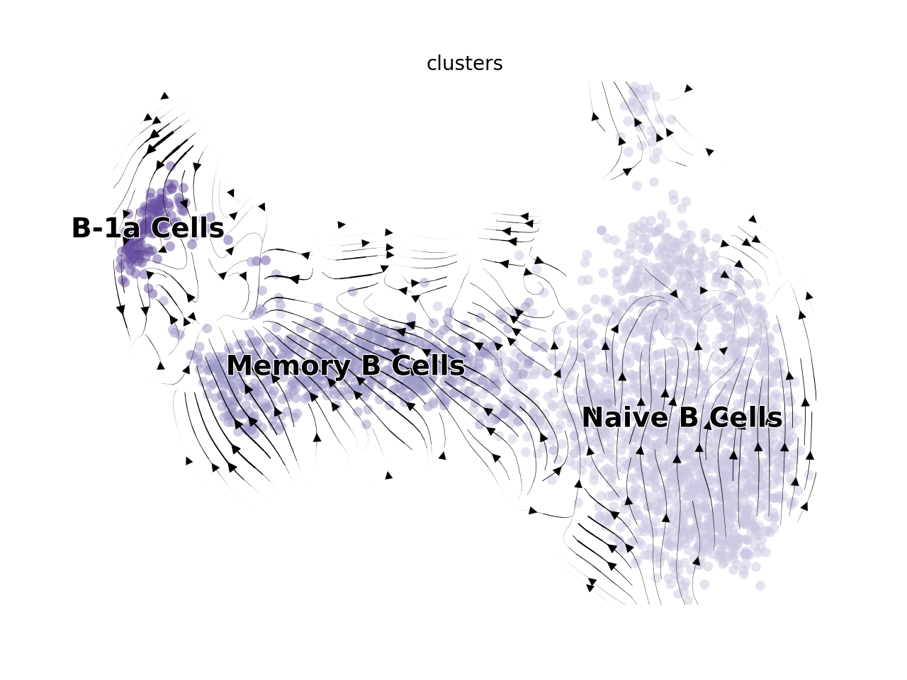

# Setup

```{r prep, warning=FALSE, message=FALSE}
library(Seurat)
library(RColorBrewer)
library(ggplot2)
library(dplyr)
library(ggpubr)
library(SingleCellExperiment)
library(reticulate)
library(viridis)

#Data file
data.integrated <- readRDS("../Inputs/IntegratedData.rds")

#Color panels
maccols <- brewer.pal(n=8, name="Blues")[c(-1,-3,-5,-7)]
monocols <- c("#ff8ade","#e324ad")
dccols <- brewer.pal(n=9, name="Greens")[-1]
tcols <- brewer.pal(n=8, name="Reds")[-1]
nkcols <- c("#876149","#6e3f22")
bcols <- brewer.pal(n=4, name="Purples")[-1]
othcols <- c("#71a157","#00c5cc","#a18e25","#b282b3")
strcols <- brewer.pal(n=4, name="Oranges")[-1]
wccols = c("#878787", "#518db6","#94cc73","#e96b53")

cols <- c(maccols,monocols,dccols,tcols,nkcols,bcols,othcols,strcols)

llcols <- c("#4292C6","#ff8ade","#238B45","#EF3B2C","#876149","#9E9AC8","#71a157","#00c5cc","#a18e25","#b282b3","#FD8D3C")

#Calculate cellspm
cellspm <- table(data.integrated$individual_mice, data.integrated$highlevel2)
propcellspm <- prop.table(cellspm, margin=1)
#Convert to a dataframe
cellspm <- as.data.frame(cellspm)
propcellspm <- as.data.frame(propcellspm)
#Change column names
colnames(cellspm) <- c("Mouse","Cluster","Counts")
colnames(propcellspm) <- c("Mouse","Cluster","Frequency")
#Add a column indicating the groups to each table
cellspm$Group <- gsub("_Hashtag.","", cellspm$Mouse)
propcellspm$Group <- gsub("_Hashtag.","", propcellspm$Mouse)
#Normalize "Counts" to "Counts per hundred cells sequenced"
cphc<-list()
cellspm <- cellspm %>% arrange(.,Mouse)
for (i in levels(cellspm$Mouse)){
  x <- sum(subset(cellspm, Mouse==i)$Counts)/100
  y <- subset(cellspm, Mouse==i)$Counts/x
  cphc <- append(cphc, y)
}
cellspm$CountsPerHundred <- as.numeric(cphc)
#Function to calculate standard error for each given variable (cell cluster)
 data_summary <- function(data, varname, groupnames){
  require(plyr)
  summary_func <- function(x, col){
    c(mean = mean(x[[col]], na.rm=TRUE),
      se = sd(x[[col]], na.rm=TRUE) / sqrt(sum(!is.na(x[[col]]))))
  }
  data_sum<-ddply(data, groupnames, .fun=summary_func,
                  varname)
names(data_sum)[names(data_sum) == 'mean'] <- varname
return(data_sum)
}
#Summarize the data
clustercounts <- data_summary(cellspm, varname="CountsPerHundred", groupnames=c("Group","Cluster"))
clusterprops <- data_summary(propcellspm, varname="Frequency", groupnames=c("Group","Cluster"))
```

# Supplemental Figure 10

## Supplemental Figure 10A

```{r SuppFig10A, fig.width=12, fig.height=4, warning=FALSE, message=FALSE}
figs6cols <- c(rep("#e6e6e6",23),"#CBC9E2","#9E9AC8","#6A51A3","#71a157",rep("#e6e6e6",6))
DimPlot(data.integrated, split.by="orig.ident",group.by="highlevel2") + 
  NoLegend() + 
  labs(title="") &
  scale_color_manual(values=figs6cols) &
 NoAxes()
```

## Supplemental Figure 10B

```{r SuppFig10Bsetup, warning=FALSE, message=FALSE}
SuppFig10Bcells <- subset(data.integrated, highlevel2=="Naive B Cells" | 
                           highlevel2=="Memory B Cells"|
                           highlevel2=="B-1a Cells"|
                           highlevel2=="Plasma Cells")
```

```{r SuppFig10B, fig.width=6, fig.height=6, warning=FALSE, message=FALSE}
Idents(SuppFig10Bcells) <- SuppFig10Bcells$highlevel2
DefaultAssay(SuppFig10Bcells) <- "RNA"
VlnPlot(SuppFig10Bcells, 
        features=c("Ms4a1","Cd19","Ccr7","Cd79a","Cd79b","Ighd","Zbtb32","Slamf9","Jchain"), 
        stack=T, 
        flip=T,
        fill.by="ident",
        cols=c("#CBC9E2","#9E9AC8","#6A51A3","#71a157")) +
  labs(x="") + 
  scale_x_discrete(labels=c("Naive B Cells","Memory B Cells","B-1a Cells","Plasma Cells")) + 
  NoLegend() +
  theme(aspect.ratio = 0.25, strip.text=element_text(face="bold.italic"), axis.text.x=element_text(size=14)) 
```

## Supplemental Figure 10C

```{r SuppFig10Csetup, warning=FALSE, message=FALSE, fig.width=6, fig.height=6}
Idents(data.integrated) <- data.integrated$orig.ident
bcellspm <- subset(cellspm, 
                      Cluster=="Naive B Cells" | 
                      Cluster=="Memory B Cells" |
                      Cluster=="B-1a Cells" | 
                      Cluster=="Plasma Cells")
bcellspm$Group <- factor(bcellspm$Group, levels = c("Lean","Obese","WL","WC"))
bclustercounts <- subset(clustercounts, 
                      Cluster=="Naive B Cells" | 
                      Cluster=="Memory B Cells" |
                      Cluster=="B-1a Cells"| 
                      Cluster=="Plasma Cells")
bclustercounts$Group <- factor(bclustercounts$Group, levels = c("Lean","Obese","WL","WC"))
```

```{r SuppFig10cstats, fig.width=3, fig.height=3, warning=FALSE, message=FALSE}
compare_means(CountsPerHundred ~ Group, data = subset(bcellspm, Cluster=="Naive B Cells"), method="t.test", p.adjust.method = "bonferroni")

compare_means(CountsPerHundred ~ Group, data = subset(bcellspm, Cluster=="Memory B Cells"), method="t.test", p.adjust.method = "bonferroni") 

compare_means(CountsPerHundred ~ Group, data = subset(bcellspm, Cluster=="B-1a Cells"), method="t.test", p.adjust.method = "bonferroni")

compare_means(CountsPerHundred ~ Group, data = subset(bcellspm, Cluster=="Plasma Cells"), method="t.test", p.adjust.method = "bonferroni")
```

```{r SuppFig10c, fig.width=3, fig.height=3, warning=FALSE, message=FALSE}
ggboxplot(d=subset(bcellspm, Cluster=="Naive B Cells"), 
          x="Group", 
          y="CountsPerHundred",  
          fill="Group", 
          facet.by="Cluster", 
          add = "mean_se")  +
    theme_classic() +
    scale_fill_manual(values=wccols) +
    theme(axis.text.x=element_text(face="bold", size=10)) + 
    labs(x="", y="") +
    theme(axis.text.x = element_blank(), axis.ticks = element_blank()) +
    facet_wrap(~Cluster) + 
    NoLegend() + 
    ylim(0,16)
ggboxplot(d=subset(bcellspm, Cluster=="Memory B Cells"), 
          x="Group", 
          y="CountsPerHundred",  
          fill="Group", 
          facet.by="Cluster", 
          add = "mean_se") +
    theme_classic() +
    scale_fill_manual(values=wccols) +
    theme(axis.text.x=element_text(face="bold", size=10)) + 
    labs(x="", y="") +
    theme(axis.text.x = element_blank(), axis.ticks = element_blank()) +
    facet_wrap(~Cluster) + 
    NoLegend() + 
    ylim(0,6)
ggboxplot(d=subset(bcellspm, Cluster=="B-1a Cells"), 
          x="Group", 
          y="CountsPerHundred",  
          fill="Group", 
          facet.by="Cluster", 
          add = "mean_se") +
    theme_classic() +
    scale_fill_manual(values=wccols) +
    theme(axis.text.x=element_text(face="bold", size=10)) + 
    labs(x="", y="") +
    theme(axis.text.x = element_blank(), axis.ticks = element_blank()) +
    facet_wrap(~Cluster) + 
    NoLegend() + 
    ylim(0,2)
ggboxplot(d=subset(bcellspm, Cluster=="Plasma Cells"), 
          x="Group", 
          y="CountsPerHundred",  
          fill="Group", 
          facet.by="Cluster", 
          add = "mean_se") +
    theme_classic() +
    scale_fill_manual(values=wccols) +
    theme(axis.text.x=element_text(face="bold", size=10)) + 
    labs(x="", y="") +
    theme(axis.text.x = element_blank(), axis.ticks = element_blank()) +
    facet_wrap(~Cluster) + 
    NoLegend() + 
    ylim(0,4)
```

## Supplemental Figure 10D
For plotting rna velocity, I have a conda env containing scvelo (v0.2.3) and scanpy (v1.7.2).

```{r SuppFig10Dsetup, warning=FALSE, message=FALSE}
#Prep environment for reticulate (i.e. we are running Python through R)
use_condaenv("r-velocity", required = TRUE)
conda_list()
scv <- import("scvelo")
scanpy <- import("scanpy")
matplotlib <- import("matplotlib")
plt <- import("matplotlib.pyplot", as = "plt")

#Subset for Macrophage/Monocytes clusters
Idents(data.integrated) <- data.integrated$lowlevel2
Bvelo <- subset(data.integrated, idents=c("B Cells"))

#To remove noise in the velocity embedding, I removed cells that were not on the same cluster trajectory (i.e. 100% disconnected).
Bvelo_cells <- CellSelector(DimPlot(Bvelo))
Idents(Bvelo, cells=Bvelo_cells) <- "keep"
Bvelo <- subset(Bvelo, idents="keep")
Idents(Bvelo) <- Bvelo$highlevel2

#Create adata object
spliced = Bvelo@assays$spliced@counts
unspliced = Bvelo@assays$unspliced@counts
row.num <- which(rownames(spliced) %in% rownames(Bvelo@assays$RNA@counts))
spliced <- spliced[c(row.num),]
unspliced <- unspliced[c(row.num),]
ad <- import("anndata", convert=FALSE)
orig.ident <- Bvelo$orig.ident
HTO_maxID <- Bvelo$HTO_maxID
lowlevel2 <- Bvelo$lowlevel2
highlevel2 <- Bvelo$highlevel2
clusters <- Bvelo$highlevel2
dfobs <- data.frame(orig.ident, HTO_maxID, lowlevel2, highlevel2, clusters)
rownames(dfobs) <- names(Bvelo$orig.barcodes)
genes_attributes <- rownames(Bvelo@assays$RNA@counts)
dfvar <- data.frame(genes_attributes)
rownames(dfvar) <- rownames(Bvelo@assays$RNA@counts)
emb <- Embeddings(Bvelo, "umap")
adata_B <- ad$AnnData(
  X=t(Bvelo@assays$RNA@counts),
  obs=dfobs,
  var=dfvar,
  layers=list('spliced'=t(spliced), 'unspliced'=t(unspliced)),
  obsm=list('X_umap'=emb))
adata_B

#Run through the scvelo pipeline and generate a dynamic velocity estimate. This takes a long time.
scv$pp$filter_genes(adata_B)
scv$pp$moments(adata_B)
scv$tl$recover_dynamics(adata_B)
scv$tl$velocity(adata_B)
scv$tl$velocity_graph(adata_B)

#Colors  for plot
B.colors <- c("#CBC9E2","#9E9AC8","#6A51A3")
```

```{r SuppFig10d, fig.width=5, fig.height=5, warning=FALSE, message=FALSE}
#These will open a separate window because they run through reticulate.
scv$pl$velocity_embedding_stream(adata_B, 
                                 basis='umap', 
                                 size=100,
                                 legend_fontsize=14,
                                 palette=B.colors,
                                 min_mass=0,
                                 smooth=TRUE,
                                 alpha=0.5)


```

# Session Info

```{r si}
sessionInfo()
```
